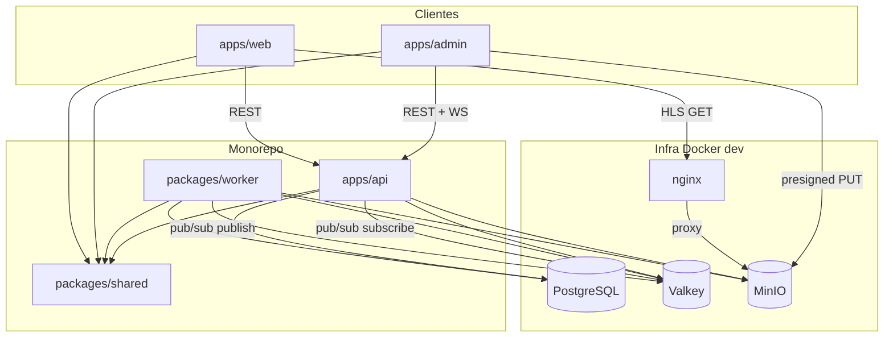
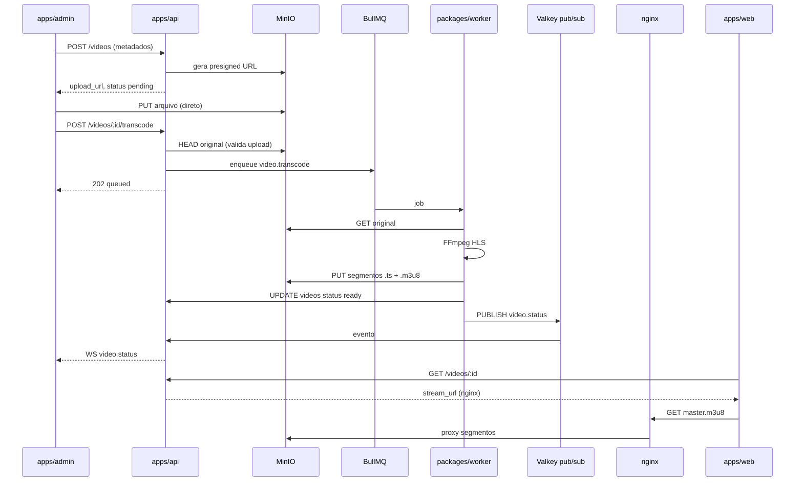

# Arquitetura — Play+ v0 (Vertical Slice)

> **Status:** vigente para implementação do vertical slice v0  
> **ADRs:** [docs/adr/](./adr/)  
> **Contratos:** [api.md](./api.md) · **Stack:** [stack.md](./stack.md)

Documento de referência para bootstrap greenfield e pipeline upload → transcode → playback.

---

## Contexto

Plataforma **pessoal e privada** de streaming. Usuário único (admin + viewer). Monorepo pnpm + Turborepo. Ambiente dev via Docker Compose (postgres, valkey, minio, nginx, api, worker).

---

## Visão de contexto



---

## Superfícies e dependências

| Superfície        | Responsabilidade v0                                                                            |
| ----------------- | ---------------------------------------------------------------------------------------------- |
| `packages/shared` | Tipos, DTOs, enums, erros + wrappers finos de desacoplamento (ADR-008) — sem lógica de negócio |
| `apps/api`        | Auth, módulos User/Video (DDD), REST `/v1`, WebSocket                                          |
| `packages/worker` | Job `video.transcode`, FFmpeg, upload HLS                                                      |
| `apps/admin`      | Login, upload presigned, listagem + WS                                                         |
| `apps/web`        | Login, catálogo, player HLS                                                                    |

**Regra inegociável:** apps → `shared` apenas; `api` ↔ `worker` via BullMQ + Valkey pub/sub (sem HTTP worker→api).

---

## Módulos DDD (`apps/api/src/modules/`)

### User

| Camada         | Artefatos v0                                           |
| -------------- | ------------------------------------------------------ |
| `domain/`      | `User`, `UserRole`, erros de auth                      |
| `application/` | `LoginUseCase`, `RefreshTokenUseCase`, `LogoutUseCase` |
| `infra/`       | `UserRepository`, `RefreshTokenStore` (Valkey)         |
| `http/`        | Rotas `/auth/*`, middleware JWT + role guard           |

### Video

| Camada         | Artefatos v0                                                                                                 |
| -------------- | ------------------------------------------------------------------------------------------------------------ |
| `domain/`      | `Video`, `VideoStatus`, regras de transição de status                                                        |
| `application/` | `CreateVideoUseCase`, `RenewUploadUrlUseCase`, `EnqueueTranscodeUseCase`, `ListVideosQuery`, `GetVideoQuery` |
| `infra/`       | `VideoRepository`, `StorageClient` (presigned + HEAD), `TranscodeQueue` (BullMQ)                             |
| `http/`        | Rotas `/videos/*`, handler WebSocket                                                                         |

**WatchSession:** defer v0.1 — sem módulo ativo no v0.

---

## Pipeline de vídeo (sequência)



---

## Modelo de dados (PostgreSQL)

### `users`

| Coluna          | Tipo           | Notas               |
| --------------- | -------------- | ------------------- |
| `id`            | UUID PK        |                     |
| `email`         | VARCHAR UNIQUE | seed único          |
| `password_hash` | VARCHAR        | bcrypt/argon2       |
| `role`          | ENUM           | `admin` \| `viewer` |
| `created_at`    | TIMESTAMPTZ    |                     |

### `videos`

| Coluna                 | Tipo         | Notas                                                       |
| ---------------------- | ------------ | ----------------------------------------------------------- |
| `id`                   | UUID PK      |                                                             |
| `title`                | VARCHAR      |                                                             |
| `file_name`            | VARCHAR      | nome original                                               |
| `file_size`            | BIGINT       | informado pelo cliente                                      |
| `duration`             | INT NULL     | segundos, preenchido pós-transcode                          |
| `status`               | ENUM         | `pending` \| `queued` \| `processing` \| `ready` \| `error` |
| `upload_complete`      | BOOLEAN      | default false; ver ADR-005                                  |
| `storage_original_key` | VARCHAR      | `videos/{id}/original/{file_name}`                          |
| `storage_hls_prefix`   | VARCHAR NULL | `videos/{id}/hls/`                                          |
| `error_reason`         | VARCHAR NULL | motivo FFmpeg/job                                           |
| `created_at`           | TIMESTAMPTZ  |                                                             |
| `updated_at`           | TIMESTAMPTZ  |                                                             |

Índices: `(status)`, `(created_at DESC)`.

Refresh tokens: **Valkey** (`refresh:{tokenId}`), não PostgreSQL.

---

## Layout de storage (MinIO / R2)

```
{bucket}/
  videos/{videoId}/
    original/{fileName}          ← upload presigned
    hls/
      master.m3u8
      240p/index.m3u8 + *.ts
      480p/...
      720p/...
      1080p/...                  ← omitir rendições acima da source
```

`stream_url` retornado pela API: `{CDN_BASE}/videos/{id}/hls/master.m3u8`  
Dev: `CDN_BASE=http://localhost:8080/media` (nginx) — ver [ADR-003](./adr/ADR-003-hls-delivery-dev-nginx-proxy.md).

---

## WebSocket (`/v1/ws?token=`)

| Evento            | Direção         | Emissor            |
| ----------------- | --------------- | ------------------ |
| `video.status`    | server → client | API (após pub/sub) |
| `video.error`     | server → client | API (após pub/sub) |
| `player.progress` | client → server | defer v0.1         |

Handler WS na API:

1. Valida JWT da query string
2. Mantém registry de conexões por `userId`
3. Subscribe Valkey channel `playplus:events:video`
4. Fan-out para conexões admin autenticadas

Ver [ADR-002](./adr/ADR-002-worker-events-valkey-pubsub.md).

---

## Auth e autorização

| Rota                                       | Role exigida            |
| ------------------------------------------ | ----------------------- |
| `POST /videos`, `POST /videos/:id/*` admin | `admin`                 |
| `GET /videos`, `GET /videos/:id`           | `admin` ou `viewer`     |
| `POST /auth/*`                             | público (login/refresh) |

Usuário seed: role `admin`, que **inclui** permissões viewer — ver [ADR-004](./adr/ADR-004-admin-role-includes-viewer.md).

---

## BullMQ

| Job           | Nome              | Idempotência                 |
| ------------- | ----------------- | ---------------------------- |
| Transcode HLS | `video.transcode` | `jobId: transcode:{videoId}` |

Config v0: **concurrency 1** no worker (VPS solo). Retry: 3 tentativas, backoff exponencial.

---

## Variáveis de ambiente (referência)

| Variável                    | Consumidor    | Exemplo dev                   |
| --------------------------- | ------------- | ----------------------------- |
| `DATABASE_URL`              | api, worker   | `postgresql://...`            |
| `VALKEY_URL`                | api, worker   | `redis://valkey:6379`         |
| `STORAGE_*`                 | api, worker   | endpoint MinIO                |
| `CDN_BASE_URL`              | api           | `http://localhost:8080/media` |
| `JWT_SECRET`                | api           | secret local                  |
| `ADMIN_SEED_EMAIL/PASSWORD` | api migration | usuário único                 |

---

## Decisões arquiteturais (ADRs)

| ADR                                                                   | Decisão                                  |
| --------------------------------------------------------------------- | ---------------------------------------- |
| [ADR-001](./adr/ADR-001-monorepo-bootstrap-v0.md)                     | Bootstrap monorepo e Docker Compose      |
| [ADR-002](./adr/ADR-002-worker-events-valkey-pubsub.md)               | Eventos worker→API via Valkey pub/sub    |
| [ADR-003](./adr/ADR-003-hls-delivery-dev-nginx-proxy.md)              | Entrega HLS em dev via nginx             |
| [ADR-004](./adr/ADR-004-admin-role-includes-viewer.md)                | Admin inclui permissões viewer           |
| [ADR-005](./adr/ADR-005-video-upload-complete-and-job-idempotency.md) | `upload_complete` + idempotência de jobs |

---

## Fora de escopo v0

- WatchSession / `player.progress`
- Sentry completo (api + worker + nuxt)
- Deploy prod R2 + Cloudflare CDN
- Thumbnails automáticos
- Gestão de múltiplos viewers
- Bull Board exposto publicamente

---

## Revisão

Revisar após primeiro vídeo end-to-end reproduzível ou antes de deploy prod (troca MinIO→R2).
