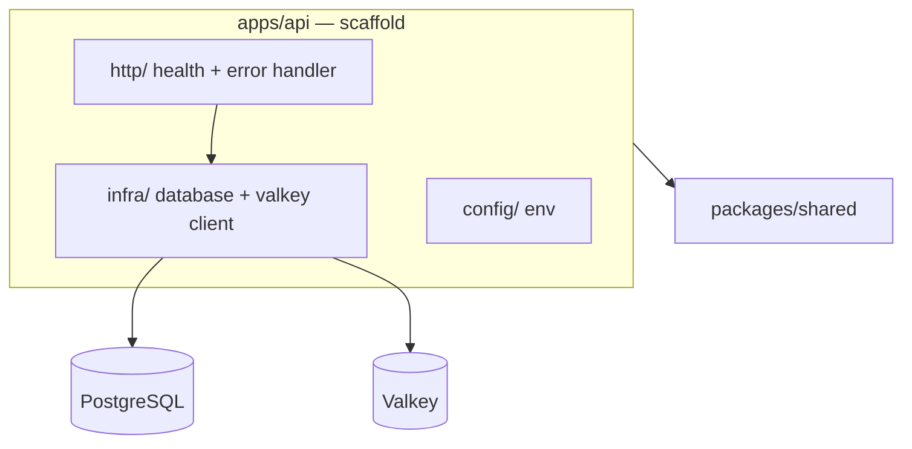

# ETD-02 — Contratos shared e API scaffold

> **Tipo:** Especificação Técnica Detalhada  
> **Identificador:** ETD-02  
> **Status:** Aprovado para implementação  
> **Pré-requisito:** ETD-01 (monorepo root + infra local)

---

## 1. Visão e escopo

Esta ETD cobre **`packages/shared`** e o scaffold de **`apps/api`** (Fastify + Drizzle + health check) — complemento da fundação definida na ETD-01.

| Superfície | Entregável |
|------------|------------|
| `packages/shared` | Tipos User/Video, enums, DTOs de auth e vídeo, erros tipados |
| `apps/api` | Bootstrap Fastify, env, postgres, valkey (health), GET /v1/health |

**Agregados:** contratos User e Video em `shared` (módulo Video ainda não implementado)

**Meta funcional:** após ETD-01 e ETD-02 implementadas, `pnpm --filter @playplus/shared build` gera contratos; `GET /v1/health` retorna 200 com postgres e valkey ok.

**Fora desta ETD:** módulo User/auth (ETD-03), módulo Video, worker, frontends, WebSocket, client S3/MinIO, nginx, Sentry.

**Validação mínima:**

- `pnpm --filter @playplus/shared build` gera contratos sem dependências externas
- `pnpm --filter @playplus/api dev` sobe em localhost:3000
- `GET /v1/health` retorna 200 com postgres e valkey ok (infra da ETD-01)

**Requisitos de negócio incorporados:**

| ID | Essência |
|----|----------|
| Contratos shared | Tipos/DTOs/enums compartilhados entre api, worker e frontends futuros — zero import entre apps |
| API scaffold | Fastify bootstrapped, Drizzle conectado, health check operacional |

---

## 2. Arquitetura

### 2.1 Regras de dependência

| Permitido | Proibido |
|-----------|----------|
| `apps/api` → `packages/shared` | `apps/api` → `apps/web`, `apps/admin`, `packages/worker` |
| Apps futuros → `shared` | Qualquer app → outro app |

Comunicação api ↔ worker (futuro) **somente** via BullMQ/Valkey — sem import direto.

Infra compartilhada da API (não pertence a um módulo): `src/config/`, `src/infra/database/`, plugins globais de erro.

---

## 3. `packages/shared`

Pacote de **contratos only** — zero dependências de runtime externas (sem Fastify, Vue, Drizzle, AWS SDK, FFmpeg).

### 3.1 Estrutura de arquivos

| Caminho | Conteúdo |
|---------|----------|
| `src/index.ts` | Barrel re-export |
| `src/enums/user-role.ts` | `UserRole` |
| `src/enums/video-status.ts` | `VideoStatus` |
| `src/enums/error-code.ts` | `ErrorCode` |
| `src/types/user.ts` | Tipo `User` |
| `src/types/video.ts` | Tipo `Video` |
| `src/dtos/login.dto.ts` | `LoginDto` |
| `src/dtos/auth-response.dto.ts` | `AuthResponseDto` |
| `src/dtos/create-video.dto.ts` | `CreateVideoDto` (uso futuro) |
| `src/errors/*.ts` | Erros tipados com propriedade `code` readonly |

Detalhamento de campos, validações e mapeamento HTTP: **§5**.

### 3.2 Package manifest

| Campo | Regra |
|-------|-------|
| `name` | `@playplus/shared` |
| `dependencies` | vazio |
| `devDependencies` | `typescript` |
| `exports` | ponto único `.` → `dist` + tipos |
| Scripts | `build`, `lint`, `typecheck`, `test` alinhados ao Turbo |

---

## 4. `apps/api` — bootstrap

### 4.1 Stack

| Componente | Escolha |
|------------|---------|
| Runtime | Node ≥ 20 |
| Framework | Fastify 5.x, TypeScript strict |
| ORM | Drizzle ORM + driver `postgres.js` |
| Validação env | `zod` ou `@fastify/env` — fail-fast no boot |
| Dev | `tsx watch src/server.ts` |

ORM único no projeto: Drizzle. Spike alternativo (Kysely) permitido por ≤ 30 min se bloquear — depois manter uma escolha.

### 4.2 Estrutura de arquivos

| Caminho | Propósito |
|---------|-----------|
| `src/server.ts` | Bootstrap Fastify, registro de plugins e rotas |
| `src/config/env.ts` | Schema e parse de variáveis (usa vars da ETD-01) |
| `src/infra/database/client.ts` | Pool + instância Drizzle singleton |
| `drizzle.config.ts` | Config migrations (migrations de domínio em ETDs posteriores) |
| `src/http/routes/health.routes.ts` | GET /v1/health |
| `src/http/plugins/error-handler.ts` | Mapeamento erros → envelope HTTP |
| `src/infra/valkey/client.ts` | Client Valkey para health check |

Módulo `user/` e schema `users` — **ETD-03**.

### 4.3 Dependências principais

| Tipo | Pacotes |
|------|---------|
| runtime | `fastify`, `@fastify/cors`, `@playplus/shared`, `drizzle-orm`, `postgres`, client Valkey (`ioredis` ou `redis`) |
| dev | `typescript`, `tsx`, `drizzle-kit`, `@types/node` |

Dependências de auth (`@fastify/cookie`, `bcrypt`/`argon2`, `jsonwebtoken`) — **ETD-03**.

### 4.4 Configuração de ambiente

Reutiliza variáveis documentadas na ETD-01. Obrigatórias para a API subir nesta ETD: `DATABASE_URL`, `VALKEY_URL`, `API_PORT`, `API_HOST`, `NODE_ENV`, `STORAGE_*` (parse only — sem client S3 nesta ETD).

Vars JWT, cookie e seed admin — consumidas na **ETD-03**; podem constar no schema env desde já (parse only) para evitar refactor posterior.

Boot aborta com mensagem clara se variável obrigatória ausente.

### 4.5 PostgreSQL (Drizzle)

- Pool via `postgres.js`; `drizzle(pool)` como singleton
- Encerramento graceful do pool em SIGTERM/SIGINT
- Script `db:migrate` preparado; migrations de domínio adicionadas em ETDs posteriores

MinIO **não** integrado nesta ETD — apenas conexão postgres e valkey ativas.

### 4.6 Error handler global

| Origem | HTTP | Code |
|--------|------|------|
| Erro não tratado | 500 | `INTERNAL_ERROR` |
| Validação Fastify | 422 | `VALIDATION_ERROR` |
| Erros tipados `shared` | conforme tabela §6.3 | code da classe |

Envelope de erro: objeto `{ error: { code, message } }`.

---

## 5. Contratos `packages/shared` — detalhamento

### 5.1 Convenções

| Camada | Convenção de campos |
|--------|---------------------|
| `packages/shared` | `camelCase` em tipos e DTOs |
| JSON da API | `snake_case` |
| PostgreSQL | `snake_case` (mapeado na infra — fora do `shared`) |

O pacote **não** contém lógica de serialização. A camada `http/` da API converte entre `shared` e JSON REST.

Tipos sensíveis (`passwordHash`, tokens) **nunca** entram em `shared` — ficam na entity de domínio da API.

### 5.2 Enums

**`UserRole`** (`src/enums/user-role.ts`)

| Valor literal | Uso |
|---------------|-----|
| `admin` | Dono; acessa rotas admin e viewer |
| `viewer` | Acesso somente a rotas viewer |

Export: objeto `as const` + type union derivado.

**`VideoStatus`** (`src/enums/video-status.ts`) — canônico REST e WebSocket futuro

| Valor | Significado |
|-------|-------------|
| `pending` | Registro criado; upload pendente |
| `queued` | Transcode enfileirado |
| `processing` | FFmpeg em execução |
| `ready` | HLS disponível |
| `error` | Falha de job/transcode |

**`ErrorCode`** (`src/enums/error-code.ts`)

| Valor | HTTP típico | Escopo |
|-------|-------------|--------|
| `UNAUTHORIZED` | 401 | auth (ETD-03) |
| `INVALID_TOKEN` | 401 | refresh (ETD-03) |
| `FORBIDDEN` | 403 | role insuficiente |
| `USER_NOT_FOUND` | 404 | /me |
| `VALIDATION_ERROR` | 422 | body inválido |
| `INTERNAL_ERROR` | 500 | erro não tratado |
| `VIDEO_NOT_FOUND` | 404 | reservado (ETD vídeo) |
| `VIDEO_NOT_READY` | 409 | reservado |
| `JOB_ALREADY_QUEUED` | 409 | reservado |

### 5.3 Tipos de domínio

**`User`** (`src/types/user.ts`) — representação pública do usuário

| Campo | Tipo TS | Obrigatório | Descrição |
|-------|---------|-------------|-----------|
| `id` | `string` | sim | UUID |
| `email` | `string` | sim | Email normalizado |
| `role` | `UserRole` | sim | `admin` \| `viewer` |
| `createdAt` | `string` | sim | ISO 8601 UTC |

**Campos proibidos no tipo:** `passwordHash`, tokens, campos de sessão.

**Mapeamento JSON (`GET /me`):** `created_at` ↔ `createdAt`.

---

**`Video`** (`src/types/video.ts`) — contrato antecipado; módulo Video fora desta ETD

| Campo | Tipo TS | Obrigatório | Descrição |
|-------|---------|-------------|-----------|
| `id` | `string` | sim | UUID |
| `title` | `string` | sim | Título exibido |
| `fileName` | `string` | sim | Nome original do arquivo |
| `fileSize` | `number` | sim | Bytes; inteiro ≥ 1 |
| `duration` | `number \| null` | sim | Segundos; null até transcode |
| `status` | `VideoStatus` | sim | Estado pipeline |
| `uploadComplete` | `boolean` | sim | Arquivo no storage |
| `storageOriginalKey` | `string` | sim | Chave S3 original |
| `storageHlsPrefix` | `string \| null` | sim | Prefixo HLS; null até ready |
| `errorReason` | `string \| null` | sim | Motivo de falha |
| `createdAt` | `string` | sim | ISO 8601 |
| `updatedAt` | `string` | sim | ISO 8601 |

### 5.4 DTOs de entrada

**`LoginDto`** (`src/dtos/login.dto.ts`) — `POST /auth/login` request (consumo HTTP em ETD-03)

| Campo | Tipo TS | Obrigatório | Validação | JSON API |
|-------|---------|-------------|-----------|----------|
| `email` | `string` | sim | formato email; max 255; trim + lowercase na API | `email` |
| `password` | `string` | sim | min 8 caracteres | `password` |

Direção: cliente → API. Não reutilizado como resposta.

---

**`CreateVideoDto`** (`src/dtos/create-video.dto.ts`) — `POST /videos` request (futuro)

| Campo | Tipo TS | Obrigatório | Validação | JSON API |
|-------|---------|-------------|-----------|----------|
| `title` | `string` | sim | min 1; max 500 | `title` |
| `fileName` | `string` | sim | min 1; max 255; sem path | `file_name` |
| `fileSize` | `number` | sim | inteiro ≥ 1 | `file_size` |

Implementar em `shared` nesta ETD; consumo HTTP em ETD posterior.

### 5.5 DTOs de saída

**`AuthResponseDto`** (`src/dtos/auth-response.dto.ts`) — login e refresh response body (consumo HTTP em ETD-03)

| Campo | Tipo TS | Obrigatório | Valor / regra | JSON API |
|-------|---------|-------------|---------------|----------|
| `accessToken` | `string` | sim | JWT compacto | `access_token` |
| `expiresIn` | `number` | sim | Segundos; default `900` | `expires_in` |

Direção: API → cliente. Refresh token **não** faz parte deste DTO — vai em cookie `httpOnly`.

---

**Resposta `/me`:** serializar tipo `User` (§5.3). Mesmos campos; mapeamento snake_case na HTTP (ETD-03).

### 5.6 Envelope de erro (convenção — não é classe em `shared`)

Contratos de erro usam `ErrorCode` + mensagem. Shape JSON:

| Campo JSON | Tipo | Origem |
|------------|------|--------|
| `error.code` | `ErrorCode` | propriedade `code` da classe de erro |
| `error.message` | `string` | `Error.message` |

### 5.7 Erros tipados

Padrão: classe extends `Error`, propriedade `readonly code: ErrorCode`, `name` = nome da classe.

| Classe | `code` default | Mensagem default | HTTP |
|--------|----------------|------------------|------|
| `UnauthorizedError` | `UNAUTHORIZED` | Não autorizado | 401 |
| `ForbiddenError` | `FORBIDDEN` | Acesso negado | 403 |
| `ValidationError` | `VALIDATION_ERROR` | Dados inválidos | 422 |
| `UserNotFoundError` | `USER_NOT_FOUND` | Usuário não encontrado | 404 |
| `VideoNotFoundError` | `VIDEO_NOT_FOUND` | Vídeo não encontrado | 404 |

Mensagem pode ser sobrescrita no construtor; `code` permanece readonly.

### 5.8 Regras de export e consumo

| Regra | Detalhe |
|-------|---------|
| Barrel | Todo contrato público exportado em `src/index.ts` |
| Import | Apps importam `@playplus/shared` — nunca `@playplus/shared/src/...` |
| Breaking change | Alterar campo de DTO/tipo exige revisão de api, worker, web, admin |
| Testes | `shared` testável sem mock de framework — apenas tipos e erros |

Mapeamento endpoint ↔ contratos auth: **ETD-03 §4.6**.

---

## 6. Endpoints

**Base URL dev:** `http://localhost:3000/v1`

**Padrão de URL:** `/modulo/recurso` ou `/modulo/recurso/:id` — ações extras só quando não mapeável por verbo HTTP.

### 6.1 Catálogo (escopo ETD-02)

| Método | Path | Auth | Descrição |
|--------|------|------|-----------|
| GET | `/health` | — | Liveness + checks postgres/valkey |

Rotas auth e `/me` — **ETD-03**.

Todas as rotas registradas sob prefixo `/v1` no Fastify.

### 6.2 Convenções de resposta

| HTTP | Body | Uso |
|------|------|-----|
| 200 | Objeto JSON direto | Sucesso com payload |
| 401 | `{ error: { code, message } }` | Auth inválida |
| 422 | `{ error: { code, message } }` | Validação schema |
| 500 | `{ error: { code, message } }` | Erro interno |
| 503 | Objeto health degradado | Dependência indisponível (health only) |

Campos JSON em **snake_case**. Erros sempre envelopados; sucessos sem envelope.

### 6.3 GET `/health`

| Item | Valor |
|------|-------|
| Autenticação | Nenhuma |
| Query params | Nenhum |

**Response 200:**

| Campo | Tipo | Descrição |
|-------|------|-----------|
| `status` | string | `ok` |
| `timestamp` | string | ISO 8601 UTC |
| `checks.database` | string | `ok` \| `error` |
| `checks.valkey` | string | `ok` \| `error` |

**Response 503:** mesmo shape com `status: degraded`; checks com falha indicam `error`.

**Side effects:** nenhum. MinIO não verificado.

---

## 7. Verificação

| # | Critério |
|---|----------|
| 1 | `@playplus/shared` builda; zero deps runtime externas |
| 2 | `@playplus/api` importa tipos de `shared` sem erro de compilação |
| 3 | `GET /v1/health` → 200 com postgres e valkey ok |
| 4 | API sobe sem módulo User — auth validada na ETD-03 |

---

## 8. Riscos

| Risco | Mitigação |
|-------|-----------|
| ORM inconsistente | Drizzle como padrão único desde o bootstrap |
| Enum VideoStatus divergente no futuro | Valores §5.2 canônicos para REST e WS |
| Health check falso positivo | Ping real ao postgres e valkey, não apenas TCP |

---

## 9. Entregas futuras

| Item | Descrição |
|------|-----------|
| Módulo User + auth JWT | ETD-03 |
| Módulo Video (API REST) | ETD-04 |
| Client S3 | Integração MinIO/R2 na API — ETD-04 |
| WebSocket | Eventos de vídeo via Valkey pub/sub |
| `packages/worker` | BullMQ + FFmpeg |
| Frontends | `apps/admin` — ETD-05; `apps/web` — ETD-06 · ETD-07 |
| Sentry | Erros de rota |

---

*ETD-02 · Play+ v0 · Shared + API scaffold*
