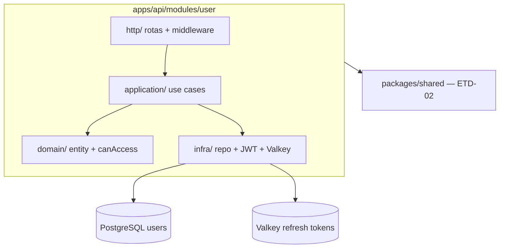

# ETD-03 — Módulo User e autenticação JWT

> **Tipo:** Especificação Técnica Detalhada  
> **Identificador:** ETD-03  
> **Status:** Aprovado para implementação  
> **Pré-requisito:** ETD-02 (contratos `packages/shared` + scaffold `apps/api` com health check)

---

## 1. Visão e escopo

Esta ETD cobre o **módulo User** em `apps/api`: persistência de usuários, autenticação JWT, refresh rotation no Valkey, logout e guards de role — complemento da fundação (ETD-01) e dos contratos/scaffold (ETD-02).

| Superfície | Entregável |
|------------|------------|
| `apps/api` — módulo `user/` | Domain, application, infra e HTTP de auth |
| Persistência | Migration `users`, seed admin, refresh tokens no Valkey |
| Rotas | `POST /auth/login`, `/auth/refresh`, `/auth/logout`, `GET /me` |

**Agregado:** User

**Meta funcional:** após ETD-01, ETD-02 e ETD-03 implementadas, `POST /v1/auth/login` retorna JWT; rotas protegidas e refresh rotation funcionam; `GET /v1/me` valida o guard.

**Fora desta ETD:** criação do pacote `shared` (ETD-02), health check (ETD-02), módulo Video, worker, frontends, WebSocket, gestão de viewers via UI.

**Validação mínima:**

- Migration + seed criam usuário admin a partir de env
- Fluxo completo: login → Bearer em rota protegida → refresh com cookie → logout invalida refresh
- Login responde em ≤ 500 ms em dev local

**Requisito de negócio incorporado (US-USR-001):**

| Critério | Comportamento esperado |
|----------|------------------------|
| Login com seed admin | `200` + `access_token`, `expires_in: 900` no body + `refresh_token` em cookie `httpOnly` |
| Rota protegida com Bearer válido | Autorizada |
| Token ausente ou inválido em rota protegida | `401` + `UNAUTHORIZED` |
| Refresh com cookie válido | Novo par access + refresh; token anterior invalidado no Valkey |
| Logout | `204`; refresh removido do Valkey; cookie limpo |
| Role admin em rota 🔒 admin | Autorizado; viewer recebe `403 FORBIDDEN` |
| Ambiente dev | Usuário seed único (admin) via migration — sem UI de cadastro |

**Requisitos não-funcionais:** access TTL 15 min; refresh TTL 7 dias com rotation; senha com hash bcrypt ou argon2.

---

## 2. Arquitetura



### 2.1 Regras de dependência

| Permitido | Proibido |
|-----------|----------|
| Módulo `user/` → `packages/shared` | Módulo `user/` → `apps/web`, `apps/admin`, `packages/worker` |
| Módulo `user/` → infra compartilhada da API (`src/infra/database/`) | Lógica de negócio em `http/` ou SQL em `domain/` |

Infra compartilhada (ETD-02): pool Drizzle, error handler global, plugin `@fastify/cookie`, parse de env com vars JWT/cookie/seed.

### 2.2 Camadas DDD — módulo User

| Camada | Responsabilidade | Proibido |
|--------|------------------|----------|
| `domain/` | Entity User, `canAccess`, erros de domínio | Fastify, DB, HTTP |
| `application/` | Login, Refresh, Logout use cases | Schemas HTTP, SQL |
| `infra/` | UserRepository, RefreshTokenStore, JwtService | Regras de negócio |
| `http/` | Rotas `/auth/*`, `/me`, middleware, JSON Schema | Lógica de negócio |

### 2.3 Modelo de roles (ADR-004)

Projeto com **dono = admin + viewer**. Enum `admin` | `viewer` com hierarquia implícita:

| Role | Acesso |
|------|--------|
| `admin` | Rotas admin **e** rotas viewer |
| `viewer` | Apenas rotas viewer |

Guard `canAccess(required, userRole)`:

- `required === 'viewer'` → qualquer usuário autenticado passa
- `required === 'admin'` → somente role `admin`

Seed único: role `admin`, credenciais via env na migration. Sem UI de cadastro de viewers no v0.

Alternativas rejeitadas: array de roles (overkill v0); dois usuários seed; rotas viewer públicas (viola privacidade).

**Impacto:** um login serve admin e web futura; compatível com viewers adicionais no futuro com role `viewer`.

---

## 3. Estrutura de arquivos (módulo User)

| Caminho | Propósito |
|---------|-----------|
| `src/infra/database/schema/users.ts` | Schema Drizzle tabela `users` |
| `drizzle/` | Migration `users` + script seed admin |
| `src/modules/user/domain/user.entity.ts` | Entity com `passwordHash` interno |
| `src/modules/user/domain/can-access.ts` | Hierarquia de roles |
| `src/modules/user/domain/invalid-credentials.error.ts` | Erro de domínio login falho |
| `src/modules/user/application/login.use-case.ts` | LoginUseCase |
| `src/modules/user/application/refresh-token.use-case.ts` | RefreshTokenUseCase |
| `src/modules/user/application/logout.use-case.ts` | LogoutUseCase |
| `src/modules/user/infra/user.repository.ts` | UserRepository |
| `src/modules/user/infra/refresh-token.store.ts` | RefreshTokenStore (Valkey) |
| `src/modules/user/infra/jwt.service.ts` | JwtService |
| `src/modules/user/http/auth.routes.ts` | Rotas `/auth/*` |
| `src/modules/user/http/me.routes.ts` | GET `/me` |
| `src/modules/user/http/auth.schemas.ts` | JSON Schema Fastify login |
| `src/modules/user/http/authenticate.middleware.ts` | Bearer → `request.user` |
| `src/modules/user/http/require-role.middleware.ts` | `requireRole('admin' \| 'viewer')` |

Registro das rotas e middlewares no bootstrap da API (ETD-02 `src/server.ts`).

### 3.1 Dependências adicionais (além do scaffold ETD-02)

| Tipo | Pacotes |
|------|---------|
| runtime | `@fastify/cookie`, client Valkey (`ioredis` ou `redis`), `bcrypt` ou `@node-rs/argon2`, `jsonwebtoken` |
| dev | `@types/jsonwebtoken` |

### 3.2 Variáveis de ambiente (auth)

Reutiliza vars da ETD-01. Obrigatórias para auth funcionar:

| Variável | Uso |
|----------|-----|
| `JWT_SECRET` | Assinatura HS256 access token |
| `JWT_ACCESS_TTL_SECONDS` | Default `900` |
| `JWT_REFRESH_TTL_SECONDS` | Default `604800` (7 dias) |
| `COOKIE_SECURE` | `false` em dev localhost; `true` em prod |
| `COOKIE_SAME_SITE` | `lax` em dev; `strict` em prod |
| `ADMIN_SEED_EMAIL` | Email do usuário seed |
| `ADMIN_SEED_PASSWORD` | Senha do seed (hash na migration) |
| `VALKEY_URL` | Refresh token store |

Script `db:migrate` executa migrations + seed idempotente.

---

## 4. Contratos `packages/shared` — escopo auth

Contratos definidos na ETD-02; esta seção resume os usados pelo módulo User (autocontida para implementação).

### 4.1 Convenções

| Camada | Convenção |
|--------|-----------|
| `packages/shared` | `camelCase` em tipos e DTOs |
| JSON da API | `snake_case` |
| PostgreSQL | `snake_case` (mapeado na infra) |

Tipos sensíveis (`passwordHash`, tokens) **nunca** entram em `shared`.

### 4.2 Enums

**`UserRole`:** `admin` | `viewer`

**`ErrorCode`** (escopo auth):

| Valor | HTTP típico |
|-------|-------------|
| `UNAUTHORIZED` | 401 |
| `INVALID_TOKEN` | 401 |
| `FORBIDDEN` | 403 |
| `USER_NOT_FOUND` | 404 |
| `VALIDATION_ERROR` | 422 |
| `INTERNAL_ERROR` | 500 |

### 4.3 Tipo `User` (resposta pública)

| Campo | Tipo TS | Obrigatório | Descrição |
|-------|---------|-------------|-----------|
| `id` | `string` | sim | UUID |
| `email` | `string` | sim | Email normalizado |
| `role` | `UserRole` | sim | `admin` \| `viewer` |
| `createdAt` | `string` | sim | ISO 8601 UTC |

Mapeamento JSON (`GET /me`): `created_at` ↔ `createdAt`.

### 4.4 DTOs

**`LoginDto`** — request `POST /auth/login`

| Campo | Tipo TS | Validação | JSON API |
|-------|---------|-----------|----------|
| `email` | `string` | formato email; max 255; trim + lowercase na API | `email` |
| `password` | `string` | min 8 caracteres | `password` |

**`AuthResponseDto`** — response login e refresh

| Campo | Tipo TS | Valor / regra | JSON API |
|-------|---------|---------------|----------|
| `accessToken` | `string` | JWT compacto | `access_token` |
| `expiresIn` | `number` | Segundos; default `900` | `expires_in` |

Refresh token **não** faz parte deste DTO — vai em cookie `httpOnly`.

### 4.5 Erros tipados

| Classe | `code` | HTTP |
|--------|--------|------|
| `UnauthorizedError` | `UNAUTHORIZED` | 401 |
| `ForbiddenError` | `FORBIDDEN` | 403 |
| `ValidationError` | `VALIDATION_ERROR` | 422 |
| `UserNotFoundError` | `USER_NOT_FOUND` | 404 |

Refresh inválido na HTTP usa `INVALID_TOKEN` — mapeado na camada `http/`.

### 4.6 Mapeamento endpoint ↔ contratos

| Endpoint | Request | Response | Erros |
|----------|---------|----------|-------|
| `POST /auth/login` | `LoginDto` | `AuthResponseDto` | `UnauthorizedError`, `ValidationError` |
| `POST /auth/refresh` | — (cookie) | `AuthResponseDto` | `INVALID_TOKEN` |
| `POST /auth/logout` | — | — (204) | — |
| `GET /me` | — | `User` | `UnauthorizedError`, `UserNotFoundError` |

Envelope de erro: `{ error: { code, message } }`.

---

## 5. Endpoints

**Base URL dev:** `http://localhost:3000/v1`

**Headers globais:**

| Header | Obrigatório | Valor |
|--------|-------------|-------|
| `Content-Type` | Sim (com body) | `application/json` |
| `Authorization` | Rotas protegidas | `Bearer <access_token>` |

### 5.1 Catálogo (escopo ETD-03)

| Método | Path | Auth | Role | Descrição |
|--------|------|------|------|-----------|
| POST | `/auth/login` | — | — | Autenticação email/senha |
| POST | `/auth/refresh` | cookie | — | Renova access + rotation refresh |
| POST | `/auth/logout` | cookie ou Bearer | — | Encerra sessão refresh |
| GET | `/me` | Bearer | autenticado | Perfil do usuário corrente |

### 5.2 Convenções de resposta

| HTTP | Body | Uso |
|------|------|-----|
| 200 | Objeto JSON direto | Sucesso com payload |
| 204 | Vazio | Logout |
| 401 | `{ error: { code, message } }` | Auth inválida |
| 403 | `{ error: { code, message } }` | Role insuficiente |
| 422 | `{ error: { code, message } }` | Validação schema |
| 500 | `{ error: { code, message } }` | Erro interno |

Campos JSON em **snake_case**. Erros envelopados; sucessos sem envelope.

### 5.3 POST `/auth/login`

| Item | Valor |
|------|-------|
| Autenticação | Nenhuma |

**Request body:** mapeado para `LoginDto` (§4.4)

**Response 200:** mapeado de `AuthResponseDto` (§4.4)

| Campo | Tipo | Descrição |
|-------|------|-----------|
| `access_token` | string | JWT |
| `expires_in` | number | Segundos — `900` |

**Set-Cookie (response header):**

| Atributo | Valor |
|----------|-------|
| Nome | `refresh_token` |
| Valor | tokenId opaco (UUID) |
| `HttpOnly` | true |
| `Path` | `/` |
| `Max-Age` | `JWT_REFRESH_TTL_SECONDS` |
| `Secure` | env `COOKIE_SECURE` |
| `SameSite` | env `COOKIE_SAME_SITE` |

**Erros:**

| Condição | HTTP | Code |
|----------|------|------|
| Email não encontrado ou senha incorreta | 401 | `UNAUTHORIZED` |
| Body inválido | 422 | `VALIDATION_ERROR` |

**Side effects:** hash verificado; novo par JWT + refresh; SET Valkey; cookie emitido.

**Segurança:** mesma mensagem para email inexistente e senha errada.

### 5.4 POST `/auth/refresh`

| Item | Valor |
|------|-------|
| Autenticação | Cookie `refresh_token` |
| Request body | Vazio |

**Response 200:** idêntico a login — `access_token`, `expires_in: 900` + novo Set-Cookie `refresh_token`.

**Erros:**

| Condição | HTTP | Code |
|----------|------|------|
| Cookie ausente | 401 | `INVALID_TOKEN` |
| tokenId não encontrado no Valkey | 401 | `INVALID_TOKEN` |
| tokenId expirado (TTL) | 401 | `INVALID_TOKEN` |

**Side effects:** DELETE refresh antigo; SET refresh novo; novo JWT. Token anterior **invalidado imediatamente** (rotation).

### 5.5 POST `/auth/logout`

| Item | Valor |
|------|-------|
| Autenticação | Cookie `refresh_token` **ou** Bearer válido |
| Request body | Vazio |

**Response 204:** sem body.

**Clear-Cookie:** mesmo nome e path do login.

**Erros:** token já inválido → ainda retorna 204 (logout idempotente).

**Side effects:** DELETE chave Valkey correspondente ao refresh do cookie.

### 5.6 GET `/me`

| Item | Valor |
|------|-------|
| Autenticação | Bearer obrigatório |
| Role | Qualquer autenticado (`viewer` mínimo) |

Rota stub para validar middleware `authenticate` — padrão para rotas protegidas futuras.

**Response 200:**

| Campo | Tipo | Descrição |
|-------|------|-----------|
| `id` | string (UUID) | `users.id` |
| `email` | string | Email do usuário |
| `role` | string | `admin` \| `viewer` |
| `created_at` | string | ISO 8601 |

Campos **omitidos:** `password_hash`, tokens.

**Erros:**

| Condição | HTTP | Code |
|----------|------|------|
| Bearer ausente | 401 | `UNAUTHORIZED` |
| JWT inválido ou expirado | 401 | `UNAUTHORIZED` |
| `sub` não existe em `users` | 404 | `USER_NOT_FOUND` |

**Side effects:** nenhum (read-only).

### 5.7 Códigos de erro (referência auth)

| Code | HTTP | Endpoints | Descrição |
|------|------|-----------|-----------|
| `UNAUTHORIZED` | 401 | login, /me, logout | Credenciais inválidas ou Bearer inválido |
| `INVALID_TOKEN` | 401 | refresh | Refresh ausente, expirado ou revogado |
| `FORBIDDEN` | 403 | rotas admin futuras | Role insuficiente |
| `USER_NOT_FOUND` | 404 | /me | JWT válido mas usuário removido |
| `VALIDATION_ERROR` | 422 | login | Schema body |
| `INTERNAL_ERROR` | 500 | todos | Erro não tratado |

### 5.8 JWT — claims do access token

| Claim | Tipo | Descrição |
|-------|------|-----------|
| `sub` | string (UUID) | `users.id` |
| `role` | string | `admin` \| `viewer` |
| `iat` | number | Issued at (unix) |
| `exp` | number | `iat + JWT_ACCESS_TTL_SECONDS` |

Algoritmo: HS256 com `JWT_SECRET`. Clock skew tolerado: ≤ 30 s (configurável).

---

## 6. Autenticação e autorização

### 6.1 Modelo de tokens

| Token | TTL | Cliente | Servidor |
|-------|-----|---------|----------|
| `access_token` | 900 s (15 min) | Memória — não localStorage | JWT stateless |
| `refresh_token` | 7 dias | Cookie `httpOnly` | Valkey — ver §7.3 |

### 6.2 Fluxo de sessão

1. `POST /auth/login` → access no body + refresh no cookie
2. Requisições → header Bearer
3. Access expirado → `POST /auth/refresh` → par rotacionado
4. `POST /auth/logout` → refresh revogado + cookie limpo

### 6.3 Middleware

| Middleware | Comportamento |
|------------|---------------|
| `authenticate` | Extrai Bearer; `JwtService.verify`; popula `request.user = { id, role }` |
| `requireRole('admin' \| 'viewer')` | `canAccess(required, request.user.role)`; falha → 403 |

Ordem típica em rotas admin futuras: `[authenticate, requireRole('admin')]`.

Rotas HTTP delegam a use cases; JSON Schema Fastify valida body de login (§5.3).

---

## 7. Módulo User — detalhamento por camada

### 7.1 Domain

| Artefato | Responsabilidade |
|----------|------------------|
| `user.entity.ts` | Entity com `passwordHash` interno — nunca exposta fora domain/infra |
| `can-access.ts` | Função hierarquia de roles (§2.3) |
| `invalid-credentials.error.ts` | Erro de domínio para login falho |

### 7.2 Application

| Use case | Entrada | Efeitos |
|----------|---------|---------|
| `LoginUseCase` | email, password | Valida hash; emite JWT + refresh; persiste refresh no Valkey; prepara Set-Cookie |
| `RefreshTokenUseCase` | tokenId do cookie | Valida Valkey; rotation; novo par |
| `LogoutUseCase` | tokenId ou userId | Delete Valkey; instrução limpar cookie |

### 7.3 Infra

| Componente | Interface |
|------------|-----------|
| `UserRepository` | `findByEmail(email)` → entity ou null; mapeamento row PostgreSQL ↔ entity |
| `RefreshTokenStore` | `save`, `get`, `delete` por tokenId — chaves `refresh:{tokenId}` no Valkey, TTL 7 dias |
| `JwtService` | `sign({ sub, role })`, `verify(token)` → payload ou erro |

**Persistência PostgreSQL — tabela `users`:**

| Coluna | Tipo | Notas |
|--------|------|-------|
| `id` | UUID PK | |
| `email` | VARCHAR UNIQUE | seed único |
| `password_hash` | VARCHAR | bcrypt/argon2 |
| `role` | ENUM | `admin` \| `viewer` |
| `created_at` | TIMESTAMPTZ | |

Migration Drizzle + seed admin idempotente: lê `ADMIN_SEED_EMAIL` e `ADMIN_SEED_PASSWORD` do env; insere apenas se email não existir; role `admin`.

Entity de domínio inclui `passwordHash` — nunca mapeada para tipos/DTOs de `shared`.

### 7.4 Http

Registra rotas sob prefixo `/v1`; schemas de login; aplica middleware em `/me` e rotas futuras admin.

---

## 8. Blocos de implementação

Sequência recomendada (dependência linear):

```
migration + seed → domain → application → infra → http (auth + /me)
```

| Bloco | Escopo | Meta de validação |
|-------|--------|-------------------|
| A | Migration, seed, domain, application (LoginUseCase) | `POST /auth/login` retorna JWT + cookie |
| B | Infra completa, Refresh/Logout use cases, HTTP + middleware | Refresh rotation + logout + `GET /me` |

---

## 9. Verificação

| # | Critério |
|---|----------|
| 1 | Migration + seed criam admin a partir de env |
| 2 | Login com seed admin → 200 + `access_token` + cookie refresh |
| 3 | `GET /v1/me` com Bearer válido → 200 com id, email, role |
| 4 | Rota protegida sem token → 401 `UNAUTHORIZED` |
| 5 | `POST /auth/refresh` com cookie válido → novo access + refresh rotacionado; token anterior invalidado no Valkey |
| 6 | `POST /auth/logout` → 204; refresh subsequente → 401 `INVALID_TOKEN` |
| 7 | Usuário admin passa em rota `requireRole('admin')`; viewer receberia 403 em rota admin |
| 8 | Sequência manual login → me → refresh → logout documentada (README ou comentário no módulo user) |

**Sequência manual de referência:** POST login com email/senha do seed (salvar cookie) → GET /me com Bearer → POST /refresh reutilizando cookie → POST /logout → refresh deve falhar.

---

## 10. Riscos

| Risco | Mitigação |
|-------|-----------|
| Cookie Secure/SameSite em localhost | `COOKIE_SECURE=false` + `COOKIE_SAME_SITE=lax` em dev via env |
| Refresh rotation race condition | Invalidar token anterior antes de emitir novo |
| Senha seed fraca em dev | Documentar troca obrigatória; nunca commitar `.env` |
| Admin precisa acessar web futura | Role admin inclui permissões viewer (§2.3) |

---

## 11. Entregas futuras

| Item | Descrição |
|------|-----------|
| Módulo Video (API REST) | ETD-04 |
| Frontends | `apps/admin` — ETD-05; `apps/web` — ETD-06 · ETD-07 |
| WebSocket | JWT via query param `?token=` |
| Testes de integração auth | testcontainers ou Docker compose em CI |
| Gestão de viewers | Cadastro com role `viewer` — reavaliar RBAC (ADR-004) |
| Sentry | Erros de rota e auth |

---

*ETD-03 · Play+ v0 · Auth API*
