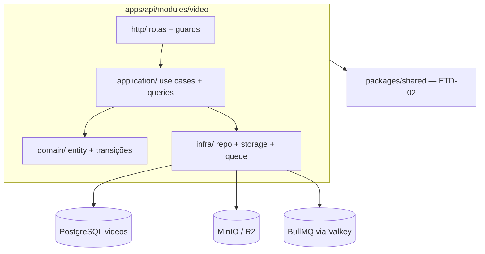

# ETD-04 — Módulo Video (API REST)

> **Tipo:** Especificação Técnica Detalhada  
> **Identificador:** ETD-04  
> **Status:** Aprovado para implementação  
> **Pré-requisito:** ETD-03 (auth JWT + guards operacionais)

---

## 1. Visão e escopo

Esta ETD cobre o **módulo Video** em `apps/api`: registro de vídeo, upload presigned para storage, enfileiramento de transcode via BullMQ e catálogo REST — complemento da fundação (ETD-01), contratos/scaffold (ETD-02) e auth (ETD-03).

| Superfície | Entregável |
|------------|------------|
| `apps/api` — módulo `video/` | Domain, application, infra e HTTP |
| Persistência | Migration `videos` |
| Storage | Client S3-compatible — presigned PUT + HEAD (MinIO dev / R2 prod) |
| Fila | Producer BullMQ `video.transcode` (consumer no worker — ETD posterior) |
| Rotas | `POST /videos`, `POST /videos/:id/upload-url`, `POST /videos/:id/transcode`, `GET /videos`, `GET /videos/:id` |

**Agregado:** Video

**Meta funcional:** admin registra vídeo e recebe presigned URL; após upload direto ao storage, enfileira transcode; usuários autenticados listam e consultam metadados do catálogo.

**Fora desta ETD:** execução FFmpeg (`packages/worker`), WebSocket de progresso, nginx/CDN (ADR-003), `DELETE /videos/:id`, frontends, thumbnails automáticos, WatchSession/`progress` em `GET /videos/:id`, Sentry.

**Validação mínima:**

- `POST /videos` retorna `201` com `upload_url` em ≤ 300 ms (dev)
- Upload direto para presigned URL persiste objeto no MinIO
- `POST /videos/:id/transcode` retorna `202` imediatamente — sem aguardar FFmpeg
- `GET /videos` paginado responde em ≤ 500 ms com até 100 vídeos
- Sequência manual: create → presigned PUT → transcode enqueue → list/get

**Requisitos de negócio incorporados:**

| ID | Essência |
|----|----------|
| US-VID-001 | Registrar metadados + presigned URL; renovar URL em `pending`; rotas admin 🔒 |
| US-VID-003 | Enfileirar transcode assíncrono; idempotência `JOB_ALREADY_QUEUED` |
| US-VID-006 | Listar e detalhar catálogo para usuários autenticados; `stream_url` quando `ready` |

---

## 2. Arquitetura



### 2.1 Regras de dependência

| Permitido | Proibido |
|-----------|----------|
| Módulo `video/` → `packages/shared` | Módulo `video/` → `packages/worker`, `apps/web`, `apps/admin` |
| Módulo `video/` → infra compartilhada (`database`, middleware auth ETD-03) | Import direto api ↔ worker |
| Producer BullMQ na API | Executar FFmpeg na API |

Comunicação api ↔ worker **somente** via fila BullMQ/Valkey — worker consome jobs em ETD posterior.

### 2.2 Camadas DDD — módulo Video

| Camada | Responsabilidade | Proibido |
|--------|------------------|----------|
| `domain/` | Entity Video, transições `VideoStatus`, erros de domínio | Fastify, S3 SDK, BullMQ |
| `application/` | Use cases e queries (create, renew URL, enqueue, list, get) | Schemas HTTP, SQL |
| `infra/` | VideoRepository, StorageClient, TranscodeQueue | Regras de negócio |
| `http/` | Rotas `/videos/*`, JSON Schema, guards | Lógica de negócio |

### 2.3 Transições de status (pipeline)

```
pending → queued → processing → ready
                              ↘ error
```

| Status | Significado | Quem altera |
|--------|-------------|-------------|
| `pending` | Registro criado; upload pode estar pendente | API (create) |
| `queued` | Job BullMQ enfileirado | API (transcode enqueue) |
| `processing` | FFmpeg em execução | Worker (ETD posterior) |
| `ready` | HLS disponível | Worker |
| `error` | Falha de job/transcode | Worker |

Regras de domínio:

- `POST /videos/:id/upload-url` — somente `status: pending`
- `POST /videos/:id/transcode` — `pending` (com upload concluído) ou `error` (retry ADR-005)
- Transcode em `queued`, `processing` ou `ready` → rejeitar com conflito

### 2.4 Campo `upload_complete` (ADR-005)

Coluna booleana `upload_complete`, default `false`.

**Materialização lazy (v0):**

1. Em `GET /videos` (e opcionalmente `GET /videos/:id`), para cada vídeo `status: pending` com `upload_complete = false`, application executa **HEAD** em `storage_original_key`.
2. Objeto existe → atualiza `upload_complete = true` no banco; retorna `true`.
3. Objeto ausente → retorna `false`.

**Em `POST /videos/:id/transcode`:**

1. HEAD obrigatório no original — ausente → `422 VALIDATION_ERROR` ("Upload não concluído").
2. Se presente, seta `upload_complete = true` antes de enfileirar.

Alternativa rejeitada: endpoint `POST /videos/:id/confirm-upload` — defer v0; lazy HEAD suficiente para catálogo pessoal.

### 2.5 Idempotência BullMQ (ADR-005)

| Regra | Valor |
|-------|-------|
| Queue name | `video` |
| Job name | `video.transcode` |
| Job ID | `transcode:{videoId}` |

Se job com mesmo ID existe em `waiting` / `active` / `delayed` → API retorna `409 JOB_ALREADY_QUEUED`.

**Retry após `error`:** vídeo em `error` pode chamar transcode novamente se original existir (HEAD). API limpa job failed no BullMQ, reseta status para `queued` e re-enfileira com mesmo `jobId`.

Concurrency worker v0: `1` (documentado para ETD worker; API apenas produz).

### 2.6 Autorização por rota

| Rota | Guard |
|------|-------|
| `POST /videos`, `POST /videos/:id/upload-url`, `POST /videos/:id/transcode` | `authenticate` + `requireRole('admin')` |
| `GET /videos`, `GET /videos/:id` | `authenticate` + `requireRole('viewer')` |

Admin inclui permissões viewer (ADR-004, ETD-03).

---

## 3. Estrutura de arquivos (módulo Video)

| Caminho | Propósito |
|---------|-----------|
| `src/infra/database/schema/videos.ts` | Schema Drizzle tabela `videos` |
| `drizzle/` | Migration `videos` |
| `src/infra/storage/storage.client.ts` | Client S3-compatible compartilhável |
| `src/modules/video/domain/video.entity.ts` | Entity Video |
| `src/modules/video/domain/video-status.transitions.ts` | Regras de transição |
| `src/modules/video/domain/video-not-found.error.ts` | Erro domínio |
| `src/modules/video/domain/job-already-queued.error.ts` | Erro domínio |
| `src/modules/video/application/create-video.use-case.ts` | CreateVideoUseCase |
| `src/modules/video/application/renew-upload-url.use-case.ts` | RenewUploadUrlUseCase |
| `src/modules/video/application/enqueue-transcode.use-case.ts` | EnqueueTranscodeUseCase |
| `src/modules/video/application/list-videos.query.ts` | ListVideosQuery |
| `src/modules/video/application/get-video.query.ts` | GetVideoQuery |
| `src/modules/video/infra/video.repository.ts` | VideoRepository |
| `src/modules/video/infra/transcode.queue.ts` | TranscodeQueue (BullMQ producer) |
| `src/modules/video/http/videos.routes.ts` | Rotas REST |
| `src/modules/video/http/videos.schemas.ts` | JSON Schema Fastify |

Registro das rotas no bootstrap da API (ETD-02 `src/server.ts`).

### 3.1 Dependências adicionais

| Tipo | Pacotes |
|------|---------|
| runtime | `@aws-sdk/client-s3`, `@aws-sdk/s3-request-presigner`, `bullmq` |
| dev | — |

Client S3 via AWS SDK v3 — compatível com MinIO (dev) e R2 (prod) somente por vars `STORAGE_*` (ETD-01).

### 3.2 Variáveis de ambiente (vídeo)

| Variável | Uso | Default dev |
|----------|-----|-------------|
| `STORAGE_*` | Client S3 (ETD-01) | MinIO localhost:9000 |
| `CDN_BASE_URL` | Montar `stream_url` em vídeos `ready` | `http://localhost:8080/media` |
| `PRESIGNED_UPLOAD_TTL_SECONDS` | Expiração URL de upload | `3600` (1 h) |
| `VALKEY_URL` | Conexão BullMQ | redis://localhost:6379 |

Troca MinIO ↔ R2 **somente** por `STORAGE_*` — nenhuma linha de código muda.

---

## 4. Contratos `packages/shared` — escopo vídeo

Contratos base definidos na ETD-02; resumo autocontido para implementação do módulo Video.

### 4.1 Convenções

| Camada | Convenção |
|--------|-----------|
| `packages/shared` | `camelCase` |
| JSON da API | `snake_case` |
| PostgreSQL | `snake_case` (infra) |

### 4.2 Enum `VideoStatus`

| Valor | Significado |
|-------|-------------|
| `pending` | Registro criado; upload pendente |
| `queued` | Transcode enfileirado |
| `processing` | FFmpeg em execução |
| `ready` | HLS disponível |
| `error` | Falha de job/transcode |

### 4.3 Tipo `Video` (domínio completo em `shared`)

| Campo | Tipo TS | Descrição |
|-------|---------|-----------|
| `id` | `string` | UUID |
| `title` | `string` | Título exibido |
| `fileName` | `string` | Nome original |
| `fileSize` | `number` | Bytes |
| `duration` | `number \| null` | Segundos; null até transcode |
| `status` | `VideoStatus` | Estado pipeline |
| `uploadComplete` | `boolean` | Arquivo no storage |
| `storageOriginalKey` | `string` | Chave S3 original |
| `storageHlsPrefix` | `string \| null` | Prefixo HLS; null até ready |
| `errorReason` | `string \| null` | Motivo de falha |
| `createdAt` | `string` | ISO 8601 |
| `updatedAt` | `string` | ISO 8601 |

Campos internos de persistência (`storage_*`) **não** expostos em listagens públicas — mapeados na application.

### 4.4 DTO `CreateVideoDto` — request `POST /videos`

| Campo | Tipo TS | Validação | JSON API |
|-------|---------|-----------|----------|
| `title` | `string` | min 1; max 500 | `title` |
| `fileName` | `string` | min 1; max 255; sem path | `file_name` |
| `fileSize` | `number` | inteiro ≥ 1 | `file_size` |

### 4.5 Erros tipados (escopo vídeo)

| Classe | `code` | HTTP |
|--------|--------|------|
| `VideoNotFoundError` | `VIDEO_NOT_FOUND` | 404 |
| `ValidationError` | `VALIDATION_ERROR` | 422 |
| `ForbiddenError` | `FORBIDDEN` | 403 |
| `UnauthorizedError` | `UNAUTHORIZED` | 401 |

Códigos mapeados na HTTP (sem classe dedicada em `shared`):

| Code | HTTP | Uso |
|------|------|-----|
| `VIDEO_NOT_READY` | 409 | Reprodução solicitada antes de `ready` |
| `JOB_ALREADY_QUEUED` | 409 | Transcode duplicado |

### 4.6 Mapeamento endpoint ↔ contratos

| Endpoint | Request | Response | Erros |
|----------|---------|----------|-------|
| `POST /videos` | `CreateVideoDto` | shape create (§5.4) | `UnauthorizedError`, `ForbiddenError`, `ValidationError` |
| `POST /videos/:id/upload-url` | — | shape create (§5.4) | `VideoNotFoundError`, conflito status |
| `POST /videos/:id/transcode` | — | shape transcode (§5.5) | `VideoNotFoundError`, `JOB_ALREADY_QUEUED`, `ValidationError` |
| `GET /videos` | query paginação | lista paginada (§5.6) | `UnauthorizedError` |
| `GET /videos/:id` | — | detalhe (§5.7) | `VideoNotFoundError`, `UnauthorizedError`, opcional `VIDEO_NOT_READY` |

---

## 5. Endpoints

**Base URL dev:** `http://localhost:3000/v1`

**Headers globais:**

| Header | Obrigatório | Valor |
|--------|-------------|-------|
| `Content-Type` | Sim (com body) | `application/json` |
| `Authorization` | Todas as rotas desta ETD | `Bearer <access_token>` |

### 5.1 Catálogo (escopo ETD-04)

| Método | Path | Role | Descrição |
|--------|------|------|-----------|
| POST | `/videos` | admin | Registrar vídeo + presigned URL |
| POST | `/videos/:id/upload-url` | admin | Renovar presigned URL |
| POST | `/videos/:id/transcode` | admin | Enfileirar transcode |
| GET | `/videos` | autenticado | Listar catálogo paginado |
| GET | `/videos/:id` | autenticado | Detalhe de vídeo |

### 5.2 Convenções de resposta

| HTTP | Body | Uso |
|------|------|-----|
| 200 | Objeto JSON direto | Sucesso |
| 201 | Objeto JSON direto | Create vídeo |
| 202 | Objeto JSON direto | Transcode enfileirado |
| 401 | `{ error: { code, message } }` | Auth inválida |
| 403 | `{ error: { code, message } }` | Role insuficiente |
| 404 | `{ error: { code, message } }` | Vídeo não encontrado |
| 409 | `{ error: { code, message } }` | Conflito (not ready, job queued) |
| 422 | `{ error: { code, message } }` | Validação / upload incompleto |
| 500 | `{ error: { code, message } }` | Erro interno |

Listas: `{ "data": [...], "meta": { "total", "page", "limit" } }`.

Campos JSON em **snake_case**.

### 5.3 POST `/videos`

| Item | Valor |
|------|-------|
| Autenticação | Bearer + role `admin` |

**Request body:** `CreateVideoDto` (§4.4)

**Response 201:**

| Campo | Tipo | Descrição |
|-------|------|-----------|
| `id` | string (UUID) | ID gerado |
| `upload_url` | string | Presigned PUT para original |
| `status` | string | `pending` |

**Side effects:**

- INSERT em `videos` com `status: pending`, `upload_complete: false`
- `storage_original_key` = `videos/{id}/original/{file_name}`
- `storage_hls_prefix` = `videos/{id}/hls/` (reservado)
- Presigned URL gerada via StorageClient — TTL `PRESIGNED_UPLOAD_TTL_SECONDS`

**Erros:**

| Condição | HTTP | Code |
|----------|------|------|
| Sem token / Bearer inválido | 401 | `UNAUTHORIZED` |
| Role viewer | 403 | `FORBIDDEN` |
| Body inválido | 422 | `VALIDATION_ERROR` |

**Segurança:** API nunca recebe binário do vídeo.

### 5.4 POST `/videos/:id/upload-url`

| Item | Valor |
|------|-------|
| Autenticação | Bearer + role `admin` |
| Path param | `id` — UUID |

**Response 200:**

| Campo | Tipo | Descrição |
|-------|------|-----------|
| `id` | string | Mesmo vídeo |
| `upload_url` | string | Nova presigned URL |
| `status` | string | `pending` |

**Erros:**

| Condição | HTTP | Code |
|----------|------|------|
| Vídeo inexistente | 404 | `VIDEO_NOT_FOUND` |
| Status ≠ `pending` | 409 | `VIDEO_NOT_READY` ou mensagem de conflito |
| Sem auth admin | 401 / 403 | conforme guard |

**Side effects:** nova presigned URL — **sem** duplicar registro.

### 5.5 POST `/videos/:id/transcode`

| Item | Valor |
|------|-------|
| Autenticação | Bearer + role `admin` |
| Request body | Vazio |

**Response 202:**

| Campo | Tipo | Descrição |
|-------|------|-----------|
| `job_id` | string | ID BullMQ (`transcode:{videoId}`) |
| `status` | string | `queued` |

**Pré-condições:**

1. Vídeo existe
2. Status `pending` ou `error` (retry)
3. HEAD confirma objeto original no storage
4. Job `transcode:{videoId}` não está ativo na fila

**Side effects:**

- `upload_complete = true`
- Status → `queued`
- Job BullMQ enfileirado com payload mínimo: `{ videoId, storageOriginalKey, fileName, fileSize }`
- Resposta HTTP **imediata** — ≤ 200 ms (enfileiramento)

**Erros:**

| Condição | HTTP | Code |
|----------|------|------|
| Vídeo inexistente | 404 | `VIDEO_NOT_FOUND` |
| Upload não concluído (HEAD falha) | 422 | `VALIDATION_ERROR` |
| Job já enfileirado | 409 | `JOB_ALREADY_QUEUED` |
| Status `queued` / `processing` / `ready` | 409 | `JOB_ALREADY_QUEUED` ou conflito |
| Sem auth admin | 401 / 403 | conforme guard |

Progresso pós-enqueue via WebSocket — ETD posterior.

### 5.6 GET `/videos`

| Item | Valor |
|------|-------|
| Autenticação | Bearer + qualquer role autenticada |

**Query params:**

| Param | Tipo | Default | Descrição |
|-------|------|---------|-----------|
| `page` | integer | `1` | Página (≥ 1) |
| `limit` | integer | `20` | Itens por página (1–100) |
| `status` | string | — | Filtro opcional: `ready`, `processing`, `error` |

Nota: filtro admin "Em andamento" (`queued` + `processing`) é **client-side** no v0 — API não expõe filtro combinado.

**Response 200:**

| Campo | Tipo | Descrição |
|-------|------|-----------|
| `data` | array | Itens do catálogo |
| `meta.total` | number | Total matching |
| `meta.page` | number | Página atual |
| `meta.limit` | number | Limite usado |

**Item em `data`:**

| Campo | Tipo | Descrição |
|-------|------|-----------|
| `id` | string | UUID |
| `title` | string | Título |
| `duration` | number \| null | Segundos; null se não transcodificado |
| `thumbnail_url` | string \| null | URL thumbnail; `null` no v0 |
| `status` | string | `VideoStatus` |
| `upload_complete` | boolean | **Somente** se `status: pending` |
| `created_at` | string | ISO 8601 |

Para itens `pending` com `upload_complete = false`: lazy HEAD (§2.4) antes de responder.

**Erros:** sem auth → `401 UNAUTHORIZED`.

### 5.7 GET `/videos/:id`

| Item | Valor |
|------|-------|
| Autenticação | Bearer + qualquer role autenticada |
| Path param | `id` — UUID |

**Response 200** (vídeo `ready`):

| Campo | Tipo | Descrição |
|-------|------|-----------|
| `id` | string | UUID |
| `title` | string | Título |
| `duration` | number | Segundos |
| `thumbnail_url` | string \| null | `null` no v0 |
| `stream_url` | string | `{CDN_BASE_URL}/videos/{id}/hls/master.m3u8` |
| `status` | string | `ready` |
| `progress` | object \| null | `null` no v0 (defer WatchSession) |
| `created_at` | string | ISO 8601 |

**Response 200** (status ≠ `ready` — metadados parciais):

| Campo | Tipo | Descrição |
|-------|------|-----------|
| `id` | string | UUID |
| `title` | string | Título |
| `duration` | number \| null | null até transcode |
| `thumbnail_url` | null | v0 |
| `status` | string | `pending`, `queued`, `processing`, `error` |
| `created_at` | string | ISO 8601 |

`stream_url` **omitido** quando não `ready`.

**Response 409** (alternativa — cliente solicita reprodução):

| Code | Quando |
|------|--------|
| `VIDEO_NOT_READY` | `pending`, `queued`, `processing` |

Implementação pode retornar `200` parcial **ou** `409` — UI deve tratar ambos.

**Erros:**

| Condição | HTTP | Code |
|----------|------|------|
| Vídeo inexistente | 404 | `VIDEO_NOT_FOUND` |
| Sem auth | 401 | `UNAUTHORIZED` |

### 5.8 Layout de storage

```
{bucket}/
  videos/{videoId}/
    original/{fileName}     ← upload presigned (PUT)
    hls/
      master.m3u8           ← worker (ETD posterior)
      {quality}/index.m3u8 + *.ts
```

`stream_url` aponta para CDN/nginx — credenciais R2 **nunca** expostas ao cliente.

---

## 6. Infraestrutura — detalhamento

### 6.1 PostgreSQL — tabela `videos`

| Coluna | Tipo | Notas |
|--------|------|-------|
| `id` | UUID PK | |
| `title` | VARCHAR | |
| `file_name` | VARCHAR | nome original |
| `file_size` | BIGINT | informado pelo cliente |
| `duration` | INT NULL | preenchido pós-transcode |
| `status` | ENUM | `pending` \| `queued` \| `processing` \| `ready` \| `error` |
| `upload_complete` | BOOLEAN | default `false` |
| `storage_original_key` | VARCHAR | `videos/{id}/original/{file_name}` |
| `storage_hls_prefix` | VARCHAR NULL | `videos/{id}/hls/` |
| `error_reason` | VARCHAR NULL | motivo FFmpeg/job |
| `created_at` | TIMESTAMPTZ | |
| `updated_at` | TIMESTAMPTZ | |

Índices: `(status)`, `(created_at DESC)`.

### 6.2 StorageClient

| Método | Responsabilidade |
|--------|------------------|
| `getPresignedUploadUrl(key, ttlSeconds)` | URL PUT assinada para upload direto |
| `objectExists(key)` | HEAD — retorna boolean |

Configuração via `STORAGE_ENDPOINT`, `STORAGE_BUCKET`, `STORAGE_ACCESS_KEY`, `STORAGE_SECRET_KEY`, `STORAGE_REGION`.

### 6.3 TranscodeQueue (BullMQ producer)

| Propriedade | Valor |
|-------------|-------|
| Conexão | `VALKEY_URL` |
| Queue | `video` |
| Job name | `video.transcode` |
| Job ID | `transcode:{videoId}` |

| Método | Comportamento |
|--------|---------------|
| `enqueue(payload)` | Adiciona job; falha se ID duplicado ativo |
| `isJobActive(videoId)` | Checa waiting/active/delayed |
| `removeFailedJob(videoId)` | Limpa job failed para retry |

Payload do job (contrato api → worker):

| Campo | Tipo | Descrição |
|-------|------|-----------|
| `videoId` | string | UUID |
| `storageOriginalKey` | string | Chave S3 do original |
| `fileName` | string | Nome original |
| `fileSize` | number | Bytes informados |

Sem credenciais de storage no payload.

### 6.4 VideoRepository

| Método | Descrição |
|--------|-----------|
| `create(data)` | INSERT vídeo `pending` |
| `findById(id)` | Entity ou null |
| `updateStatus(id, status, extras?)` | Transição persistida |
| `setUploadComplete(id, value)` | Atualiza flag |
| `list({ page, limit, status? })` | Paginação + filtro |
| `count({ status? })` | Total para meta |

---

## 7. Application — use cases e queries

| Componente | Entrada | Saída / efeitos |
|------------|---------|-----------------|
| `CreateVideoUseCase` | `CreateVideoDto` | Entity + presigned URL; persiste `pending` |
| `RenewUploadUrlUseCase` | videoId | Nova presigned; valida `pending` |
| `EnqueueTranscodeUseCase` | videoId | HEAD; enqueue; status → `queued` |
| `ListVideosQuery` | page, limit, status? | Lista + lazy HEAD em pendentes |
| `GetVideoQuery` | videoId | Detalhe + `stream_url` se `ready` |

---

## 8. Blocos de implementação

Sequência recomendada:

```
migration → domain → storage client → create + POST /videos
         → upload-url + transcode queue → list/get
```

| Bloco | Escopo | Meta de validação |
|-------|--------|-------------------|
| A | Migration `videos`, domain, StorageClient, `CreateVideoUseCase`, `POST /videos` | Admin cria vídeo e recebe presigned URL |
| B | Renew URL, TranscodeQueue, enqueue use case, rotas transcode | Upload PUT + `POST /transcode` → `202 queued` |
| C | ListVideosQuery, GetVideoQuery, rotas GET | Catálogo paginado + detalhe com lazy HEAD |

---

## 9. Verificação

| # | Critério |
|---|----------|
| 1 | Migration `videos` aplica sem erro |
| 2 | `POST /videos` como admin → `201` + `upload_url` + `status: pending` |
| 3 | `POST /videos` como viewer → `403 FORBIDDEN` |
| 4 | Presigned PUT para MinIO persiste objeto em `storage_original_key` |
| 5 | `POST /videos/:id/upload-url` em `pending` → nova URL; em `queued` → `409` |
| 6 | `POST /videos/:id/transcode` sem upload → `422`; com upload → `202` + job na fila |
| 7 | Segundo transcode no mesmo vídeo → `409 JOB_ALREADY_QUEUED` |
| 8 | `GET /videos` autenticado → lista paginada; `pending` exibe `upload_complete` |
| 9 | `GET /videos/:id` `ready` → inclui `stream_url`; `processing` → sem `stream_url` |
| 10 | Sequência manual documentada: login → create → PUT presigned → transcode → list → get |

**Sequência manual de referência:** autenticar admin → POST /videos → PUT arquivo na `upload_url` → POST /transcode → GET /videos → GET /videos/:id.

---

## 10. Riscos

| Risco | Mitigação |
|-------|-----------|
| `file_size` diverge do arquivo real | v0 confia no admin; validação pós-upload fora de escopo |
| HEAD em listagem adiciona latência | Aceitável com dezenas de vídeos; cache após primeiro `true` |
| Presigned expirada antes do upload | `POST /videos/:id/upload-url` |
| Job duplicado no BullMQ | Job ID fixo + checagem `JOB_ALREADY_QUEUED` |
| CDN/nginx indisponível em dev | `stream_url` montada mesmo sem nginx — reprodução depende ETD infra HLS |

---

## 11. Entregas futuras

| Item | Descrição |
|------|-----------|
| `packages/worker` | Consumer BullMQ + FFmpeg HLS |
| WebSocket | `video.status` / `video.error` via Valkey pub/sub |
| nginx :8080 | Proxy HLS em dev (ADR-003) |
| `DELETE /videos/:id` | Remoção de assets |
| Thumbnails | URL automática pós-transcode |
| WatchSession | Campo `progress` em `GET /videos/:id` |
| Frontends | `apps/admin` upload UI — **ETD-05**; `apps/web` catálogo — **ETD-06**; player — **ETD-07** |
| Testes integração | testcontainers + MinIO |
| Sentry | Erros de storage e fila |

---

*ETD-04 · Play+ v0 · Video API REST*
