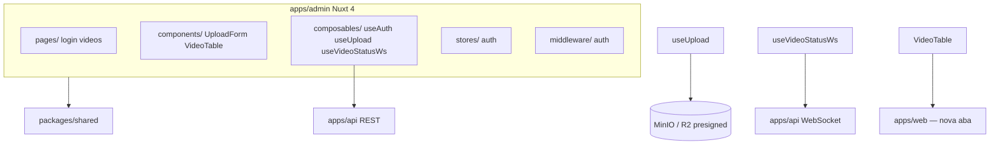

# ETD-05 — Admin UI (Nuxt 4)

> **Tipo:** Especificação Técnica Detalhada  
> **Identificador:** ETD-05  
> **Status:** Aprovado para implementação  
> **Pré-requisito:** ETD-03 (auth) + ETD-04 (Video API REST) + pipeline backend E2E (worker FFmpeg + WebSocket `video.status` / `video.error` — equivalente iter-03)

---

## 1. Visão e escopo

Esta ETD cobre **`apps/admin`**: interface administrativa Nuxt 4 para login, upload presigned, listagem de vídeos e acompanhamento de transcode em tempo real via WebSocket.

| Superfície | Entregável |
|------------|------------|
| `apps/admin` | Scaffold Nuxt 4, auth client, upload, listagem, WS |
| Páginas | `/login`, `/videos`, `/videos/new` |
| Composables | `useAuth`, `useUpload`, `useVideoStatusWs` |
| Componentes | `UploadForm`, `VideoTable`, layout admin, badges, modais |

**Meta funcional:** admin faz login → envia vídeo direto ao storage → dispara transcode manualmente → acompanha progresso na listagem sem polling → abre reprodução na web quando `ready`.

**Fora desta ETD:** `apps/web`, gestão de usuários, edição de metadados pós-create, busca por título, recuperação de senha, thumbnails reais, Sentry Nuxt, tema lavanda/menta (alternativas do mockup), `DELETE /videos/:id` na API (UI preparada; endpoint em ETD posterior).

**Validação mínima:**

- Login → redirect `/videos` com token em memória
- Upload completo sem bytes passando pela API
- Listagem atualiza status via WebSocket sem polling
- Persona admin: login → upload → transcode → progresso → `ready` → **Assistir** abre web

**Requisitos de negócio incorporados:**

| ID | Essência |
|----|----------|
| US-USR-002 | Login admin, refresh automático, logout, copy de erros, WCAG AA |
| US-VID-002 | Upload presigned com progresso XHR; transcode **manual** pós-upload |
| US-VID-007 | Listagem com status, filtros, WS, ações por status, estados vazio/loading/erro |

**Referência visual:** mockup estático `apps/admin/mockups/dc.html` — tokens e layouts desta ETD derivam da seção **Pêssego · padrão**.

---

## 2. Arquitetura



### 2.1 Regras de dependência

| Permitido | Proibido |
|-----------|----------|
| `apps/admin` → `packages/shared` | `apps/admin` → `apps/api`, `apps/web`, `packages/worker` |
| Chamadas HTTP/WS para API via URL configurável | Import de código de outro app |

### 2.2 Fluxos principais

**Auth:** middleware redireciona não autenticados → `/login`; `useAuth` mantém `accessToken` em memória (ref Pinia/composable); interceptor HTTP adiciona Bearer; 401 → refresh → retry ou redirect login.

**Upload:** `POST /videos` → XHR PUT presigned → sucesso → usuário clica **Iniciar transcodificação** → `POST /transcode`.

**Listagem:** mount → `GET /videos` + connect WS; eventos merge por `video_id`; reconnect → banner + refetch único.

---

## 3. Stack e estrutura de arquivos

### 3.1 Stack

| Componente | Escolha |
|------------|---------|
| Framework | **Nuxt 4**, Vue 3, TypeScript strict |
| Runtime | Node ≥ 20 |
| Estado | Pinia via `@pinia/nuxt` |
| Estilo | **Tailwind CSS 4** via `@nuxtjs/tailwindcss` — utility-first; tokens do §4 em `tailwind.config.ts` |
| Fonte | Plus Jakarta Sans (`@nuxtjs/google-fonts` ou link no `nuxt.config`) |
| HTTP | `$fetch` / `ofetch` com wrapper autenticado |
| Upload | XHR `upload.onprogress` (presigned PUT) |
| WebSocket | nativo `WebSocket` com reconnect |

### 3.2 Estrutura de diretórios (Nuxt 4)

Nuxt 4 usa **`app/`** como `srcDir` padrão — código Vue separado de config e de `server/` na raiz do app.

```
apps/admin/
├── nuxt.config.ts
├── tailwind.config.ts
├── package.json              # nuxt ^4, @pinia/nuxt, @nuxtjs/tailwindcss
├── public/                   # favicon, assets estáticos (rootDir)
├── app/
│   ├── app.vue               # Shell raiz
│   ├── assets/css/main.css   # @import "tailwindcss" ou @tailwind directives
│   ├── components/           # auto-import
│   ├── composables/          # auto-import
│   ├── layouts/
│   ├── middleware/
│   ├── pages/
│   ├── plugins/              # opcional — ex.: api client init
│   └── utils/
└── shared/                   # opcional — utils compartilhados app ↔ server Nitro
```

| Caminho | Propósito |
|---------|-----------|
| `nuxt.config.ts` | Env públicas, módulos, `css`, compat Nuxt 4 |
| `app/app.vue` | `<NuxtLayout>` + `<NuxtPage>` |
| `app/layouts/default.vue` | Layout autenticado (header + slot) |
| `app/layouts/auth.vue` | Layout login (split hero + form) |
| `app/pages/login.vue` | Tela de login |
| `app/pages/videos/index.vue` | Listagem |
| `app/pages/videos/new.vue` | Criar + upload |
| `app/middleware/auth.global.ts` | Guard rotas protegidas |
| `app/stores/auth.ts` | Pinia — token, user, login/logout/refresh |
| `app/composables/useAuth.ts` | Facade auth + redirect |
| `app/composables/useApi.ts` | Client HTTP base URL + Bearer + refresh |
| `app/composables/useUpload.ts` | Fluxo register → PUT → renew URL |
| `app/composables/useVideoStatusWs.ts` | WS connect, handlers, reconnect |
| `app/components/AppHeader.vue` | Logo, nav, avatar, logout |
| `app/components/VideoTable.vue` | Lista, filtros, ações, WS merge |
| `app/components/VideoRow.vue` | Linha/card de vídeo |
| `app/components/UploadForm.vue` | Form + dropzone + estados |
| `app/components/UploadModal.vue` | Modal progresso envio |
| `app/components/StatusBadge.vue` | Badge ícone + texto por status |
| `app/components/FilterPills.vue` | Filtros Todos/Pronto/Em andamento/Erro |
| `app/components/ConfirmDialog.vue` | Modal confirmação exclusão |
| `app/components/EmptyState.vue` | Catálogo vazio |
| `app/components/LoadingSkeleton.vue` | Skeleton listagem |
| `app/components/WsReconnectBanner.vue` | Banner reconexão |
| `app/components/ToastNotification.vue` | Toast upload concluído |
| `app/utils/error-messages.ts` | Mapa code API → copy UI |
| `app/utils/format.ts` | Datas, bytes, percentual |

Alias `~` aponta para `app/` — `~/components/...` resolve corretamente.

### 3.3 Convenções Nuxt 4

| Tópico | Regra |
|--------|-------|
| Scaffold | `pnpm dlx nuxi@latest init admin` com template Nuxt 4 |
| Módulos | `@pinia/nuxt`, `@nuxtjs/tailwindcss`; dev: `@nuxt/eslint` opcional |
| Auto-imports | `components/`, `composables/`, `utils/` — sem imports manuais |
| Data fetching | `useFetch` / `useAsyncData` com `key` explícita (ex.: `'videos-list'`) |
| Reatividade fetch | `data` é `shallowRef` — mutações profundas exigem reassign ou `refreshNuxtData` |
| Valor inicial | `data`/`error` default **`undefined`** (não `null`) — checar com `=== undefined` |
| Listagem vídeos | `useFetch` na page ou composable dedicado; refetch após upload/transcode via `refresh()` |
| SSR | Admin é app autenticada — `ssr: true` default; rotas protegidas podem usar `client-only` em WS mount |
| TypeScript | Projetos TS separados (app/server) gerados pelo Nuxt 4 — commitar `.nuxt/` no gitignore |

### 3.4 Variáveis de ambiente

| Variável | Uso | Exemplo dev |
|----------|-----|-------------|
| `NUXT_PUBLIC_API_URL` | Base REST | `http://localhost:3000/v1` |
| `NUXT_PUBLIC_WS_URL` | Base WebSocket | `ws://localhost:3000/v1/ws` |
| `NUXT_PUBLIC_WEB_URL` | Link **Assistir** | `http://localhost:3001` |

Cookie refresh: enviado automaticamente pelo browser em chamadas same-site à API (`credentials: 'include'`).

### 3.5 Tailwind CSS

**Módulo:** `@nuxtjs/tailwindcss` registrado em `nuxt.config.ts`. CSS entry: `app/assets/css/main.css`.

**Convenções:**

| Regra | Detalhe |
|-------|---------|
| Utility-first | Páginas e componentes de feature usam classes Tailwind no template |
| Primitivos `Pl*` | Variantes encapsuladas com `@apply` em `<style>` ou classes compostas exportadas — evita repetir combinações longas |
| Sem CSS modules | Não usar `.module.css` no v0 |
| Sem inline `style=` | Exceto valores dinâmicos (ex.: `width: ${progress}%` na barra) |
| Responsivo | Prefixos `md:`, `lg:` — login split hero em `md:flex` |
| Dark mode | Fora do v0 — sem `dark:` |
| Plugins | `@tailwindcss/forms` (opcional) para reset leve de inputs |

**`tailwind.config.ts` — `theme.extend` (mapeamento §4):**

| Chave Tailwind | Token / valor | Uso típico |
|----------------|---------------|------------|
| `colors.peach.page` | `#FBF6F2` | `bg-peach-page` |
| `colors.peach.canvas` | `#E9E1DB` | fundo login outer |
| `colors.peach.surface` | `#FFFFFF` | cards, header |
| `colors.peach.muted` | `#F4ECE5` | pills, secundários |
| `colors.peach.input` | `#FBF7F4` | fundo input |
| `colors.peach.border` | `#EFE6DE` | divisores |
| `colors.peach.border-input` | `#E6DCD3` | borda input |
| `colors.peach.primary` | `#231C18` | texto, botão primário |
| `colors.peach.secondary` | `#8A7F78` | subtítulos |
| `colors.peach.muted-text` | `#A89A8E` | meta |
| `colors.peach.label` | `#5C524C` | labels |
| `colors.peach.accent` | `#E8956B` | links destaque |
| `colors.status.pending` / `.pending-fg` | `#FBE6D6` / `#A85B2A` | badge |
| `colors.status.queued` / `.queued-fg` | `#DDE8F5` / `#3A5F94` | badge |
| `colors.status.processing` / `.processing-fg` | `#E7DCF2` / `#6B4E9E` | badge |
| `colors.status.ready` / `.ready-fg` | `#D9ECDD` / `#3C7A4A` | badge |
| `colors.status.error` / `.error-fg` | `#F8DAD9` / `#B0413C` | badge |
| `colors.feedback.error-bg` / `.error-border` / `.error-text` | §4.3 | alerts |
| `borderRadius.pl-sm` | `11px` | ícones |
| `borderRadius.pl-md` | `14px` | inputs, botões |
| `borderRadius.pl-lg` | `18px` | cards |
| `borderRadius.pl-xl` | `24px` | modais, login panel |
| `boxShadow.pl-card` | §4.4 | rows VideoTable |
| `boxShadow.pl-panel` | §4.4 | painel login |
| `boxShadow.pl-modal` | §4.4 | modais |
| `fontFamily.sans` | Plus Jakarta Sans, system-ui | `font-sans` |
| `fontSize.pl-xs` … `pl-hero` | §4.2 | escala tipográfica |
| `letterSpacing.pl-tight` | `-0.02em` | títulos |
| `backgroundImage.hero-login` | gradiente §4.3 | hero esquerdo |

**Exemplos de classes por componente:**

| Componente | Classes Tailwind (referência) |
|------------|-------------------------------|
| Botão primário | `h-12 rounded-pl-md bg-peach-primary text-white font-bold text-[15px] disabled:opacity-60` |
| Input | `h-[50px] rounded-pl-md border-[1.5px] border-peach-border-input bg-peach-input px-4 text-[15px]` |
| Card row | `flex items-center gap-[18px] rounded-pl-lg bg-peach-surface p-3 shadow-pl-card` |
| Badge pending | `inline-flex items-center gap-1.5 rounded-full bg-status-pending px-3 py-1.5 text-pl-xs font-bold text-status-pending-fg` |
| Filter pill ativo | `rounded-full bg-peach-primary px-4 py-2 text-pl-sm font-bold text-white` |
| Page bg | `min-h-screen bg-peach-page` |

**Conteúdo dinâmico:** barras de progresso usam `style="width: …%"` ou `:style` — demais layout via utilities.

**Animações:** spinner com `animate-spin`; skeleton com `animate-pulse`. Respeitar reduced motion:

```css
@media (prefers-reduced-motion: reduce) {
  .motion-safe\:animate-spin { animation: none; }
}
```

Ou variant custom `motion-reduce:animate-none` via plugin Tailwind — spinners substituídos por texto estático.

---

## 4. Design system — recursos de UI

Tokens visuais abaixo são a **fonte de verdade** — implementados em `tailwind.config.ts` (`theme.extend`) e consumidos via classes Tailwind (§3.5).

### 4.1 Princípios

| Princípio | Regra |
|-----------|-------|
| Tom | Pessoal e acolhedor — não SaaS corporativo |
| Status | Sempre **ícone + texto** — nunca cor isolada |
| Cantos | Suaves — radius generosos (14–24 px) |
| Motion | Spinners discretos; respeitar `prefers-reduced-motion` |
| Densidade | Listagem em cards horizontais (mockup), não tabela densa |

Tema implementado: **Pêssego** (padrão). Variações Lavanda/Menta do mockup ficam fora do v0.

### 4.2 Tipografia

| Token | Valor | Classe Tailwind (exemplo) |
|-------|-------|----------------------------|
| Família | `'Plus Jakarta Sans', system-ui, sans-serif` | `font-sans` |
| Pesos | 400, 500, 600, 700, 800 | `font-normal` … `font-extrabold` |
| `--text-xs` | 12px / 12.5px — meta, badges | `text-pl-xs` |
| `--text-sm` | 13–13.5px — labels, pills | `text-pl-sm` |
| `--text-base` | 14–15px — corpo, inputs | `text-pl-base` |
| `--text-lg` | 17–18px — subtítulos header | `text-pl-lg` |
| `--text-xl` | 25–26px — títulos de página | `text-pl-xl` |
| `--text-hero` | 28px — hero login | `text-pl-hero` |
| Letter-spacing títulos | `-0.02em` | `tracking-pl-tight` |
| Labels uppercase section | `0.14em`, weight 800, 13px | `text-pl-sm font-extrabold uppercase tracking-widest` |

### 4.3 Paleta — tema Pêssego

| Token / nome | Hex | Classe Tailwind |
|--------------|-----|-----------------|
| `peach.page` | `#FBF6F2` | `bg-peach-page` |
| `peach.canvas` | `#E9E1DB` | `bg-peach-canvas` |
| `peach.surface` | `#FFFFFF` | `bg-peach-surface` |
| `peach.muted` | `#F4ECE5` | `bg-peach-muted` |
| `peach.input` | `#FBF7F4` | `bg-peach-input` |
| `peach.border` | `#EFE6DE` | `border-peach-border` |
| `peach.border-input` | `#E6DCD3` | `border-peach-border-input` |
| `peach.primary` | `#231C18` | `bg-peach-primary` / `text-peach-primary` |
| `peach.secondary` | `#8A7F78` | `text-peach-secondary` |
| `peach.muted-text` | `#A89A8E` | `text-peach-muted-text` |
| `peach.label` | `#5C524C` | `text-peach-label` |
| `peach.accent` | `#E8956B` | `text-peach-accent` |
| `hero-login` | gradiente §4.3 | `bg-hero-login` |

**Status badges:**

| Status | BG | Texto | Ícone (semântica) |
|--------|-----|-------|-------------------|
| `pending` | `#FBE6D6` | `#A85B2A` | relógio / alerta suave |
| `queued` | `#DDE8F5` | `#3A5F94` | relógio fila |
| `processing` | `#E7DCF2` | `#6B4E9E` | spinner ou arco progresso |
| `ready` | `#D9ECDD` | `#3C7A4A` | check |
| `error` | `#F8DAD9` | `#B0413C` | X círculo |

**Feedback:**

| Tipo | BG | Borda | Texto |
|------|-----|-------|-------|
| Erro inline | `#FBEAE9` | `#F2C7C4` | `#B0413C` |
| Sucesso toast icon | `#D9ECDD` | — | `#3C7A4A` |
| Barra progresso upload | gradiente `#B9A3E0 → #8B6FC9` | track `#EFE6DE` |
| Barra progresso transcode | `#8B6FC9` | track `#EFE6DE` |
| Overlay modal | `rgba(35,28,24,0.46)` | — | — |

### 4.4 Espaçamento e radius

| Token | Valor | Classe Tailwind |
|-------|-------|-----------------|
| `pl-sm` | 11px | `rounded-pl-sm` |
| `pl-md` | 14px | `rounded-pl-md` |
| `pl-lg` | 18px | `rounded-pl-lg` |
| `pl-xl` | 24px | `rounded-pl-xl` |
| pill | 999px | `rounded-full` |
| `pl-card` | §4.4 shadow | `shadow-pl-card` |
| `pl-panel` | §4.4 shadow | `shadow-pl-panel` |
| `pl-modal` | §4.4 shadow | `shadow-pl-modal` |

Padding listagem: `px-9 py-7` (36/28px). Gap rows: `gap-[13px]`. Header: `h-[68px]`.

### 4.5 Componentes base (primitivos)

| Componente | Variantes | Tailwind / spec |
|------------|-----------|-----------------|
| `PlButton` | primary, secondary, danger, ghost, icon | Primary: §3.4 exemplo. Secondary: `bg-peach-muted text-peach-secondary`. Danger: `bg-feedback-error-bg text-feedback-error-text`. Icon: `size-9 rounded-pl-sm bg-peach-muted`. `@apply` opcional no SFC |
| `PlInput` | default, error | §3.4 exemplo; error: `border-red-200 bg-red-50/30` mapeado a feedback tokens |
| `PlLabel` | — | `text-pl-sm font-semibold text-peach-label mb-2` |
| `PlAlert` | error, info | Error: `bg-feedback-error-bg border border-feedback-error-border rounded-pl-md p-3 role="alert"`. Info: `bg-[#F6F1EC]` |
| `PlProgressBar` | upload, transcode | `h-2.5 rounded-full bg-peach-border overflow-hidden`; fill via `:style` |
| `PlModal` | dialog | Overlay `fixed inset-0 bg-black/45`; panel `rounded-pl-xl bg-peach-surface shadow-pl-modal p-6` |
| `PlToast` | success | `fixed top-20 right-6 w-[380px] rounded-pl-lg shadow-pl-modal border border-peach-border` |
| `PlSkeleton` | row | `animate-pulse rounded-pl-lg bg-peach-muted` |

### 4.6 Ícones

SVG inline (stroke 2–2.4px, round caps) — sem biblioteca externa no v0.

| Contexto | Ícone |
|----------|-------|
| Logo Play+ | triângulo play em quadrado arredondado |
| Adicionar | plus |
| Logout | door-arrow |
| Upload dropzone | seta para cima + nuvem |
| Editar | lápis (v0 desabilitado ou oculto) |
| Excluir | lixeira |
| Assistir | external link |
| Retry | seta circular |
| Fechar | X |

Todos botões ícone: `36×36px`, bg `#F4ECE5` (excluir: bg `#FBEAE9`), `aria-label` obrigatório, `title` opcional.

---

## 5. Páginas e layouts

### 5.1 Layout `auth` — Login

Split horizontal (breakpoint ≥ md):

| Zona | Largura | Conteúdo |
|------|---------|----------|
| Hero esquerdo | ~480px fixo | Gradiente pêssego, logo, silhuetas poster cards decorativas, headline *"Seu cinema particular."*, sub *"Guarde, assista e retome de onde parou."* |
| Form direito | flex 1 | Título *"Bem-vindo de volta"*, subtítulo *"Faça login para continuar."*, campos, submit |

Mobile: hero colapsa — apenas form centralizado com logo compacto no topo.

**Não exibir** link *"Esqueceu a senha?"* (fora de escopo US-USR-002).

### 5.2 Página `/login`

| Estado | UI |
|--------|-----|
| Default | Form email + senha + toggle mostrar senha + botão **Entrar** |
| Loading | Botão **Entrando…** + spinner; campos disabled |
| Erro credenciais | Alert *"E-mail ou senha incorretos."* |
| Erro validação | Mensagens por campo abaixo do input |
| Sessão expirada | Query `?reason=session_expired` → alert *"Sua sessão expirou. Faça login novamente."* |

Query `?redirect=` preservada; pós-login redirect se path interno válido, senão `/videos`.

Campos: `autocomplete="email"` / `autocomplete="current-password"`.

### 5.3 Layout `default` — App autenticado

**AppHeader** fixo 68px:

| Elemento | Posição | Detalhe |
|----------|---------|---------|
| Logo Play+ | esquerda | 34px ícone + wordmark 18px weight 800 |
| Nav pill **Vídeos** | após logo | bg `#F4ECE5`, ativo quando em `/videos*` |
| Spacer | flex 1 | — |
| Avatar + nome | direita | Círculo gradiente `#E89B8E → #C97FB0`, nome do `/me` |
| Botão logout | direita | Ícone door, `aria-label="Sair"` |

Busca *"Buscar vídeo…"* do mockup: **não implementar** v0.

Notificações (sino): **não implementar** v0.

### 5.4 Página `/videos` — Listagem

**Cabeçalho de página:**

| Elemento | Copy / comportamento |
|----------|---------------------|
| Título | *"Meus vídeos"* |
| Subtítulo dinâmico | `"{total} vídeos · {n} na fila, {m} transcodificando"` — calculado client-side |
| FilterPills | Todos · Pronto · Em andamento · Erro |
| CTA | **+ Adicionar vídeo** → `/videos/new` |

**Estados de página:**

| Estado | UI |
|--------|-----|
| Loading | `LoadingSkeleton` × 5 rows |
| Empty | `EmptyState`: ilustração minimal + *"Nenhum vídeo ainda"* + CTA **Adicionar vídeo** |
| Error | Alert + botão **Tentar novamente** → refetch |
| Success | `VideoTable` |
| WS disconnected | `WsReconnectBanner` sticky: *"Reconectando…"* |

**Paginação:** controles anterior/próximo quando `meta.total > meta.limit`; exibir *"Página {page} de {pages}"*.

### 5.5 Página `/videos/new` — Criar e enviar

Mesmo shell header com botão **Voltar** (←) para `/videos`.

| Seção | Conteúdo |
|-------|----------|
| Título campo | Input texto, max 500 |
| Arquivo | Dropzone tracejada `#DCCFC3` + botão **Procurar arquivo** |
| Hint dropzone | *"MP4, MOV ou MKV · até 2 GB (v0)"* |
| Arquivo selecionado | Card com nome, tamanho formatado, tipo, botão remover |
| Footer | **Cancelar** (secondary) · **Salvar e enviar** (primary) |

Validação client: arquivo obrigatório; título min 1; tamanho ≤ 2 GB → *"O arquivo excede o limite de 2 GB."*

Submit abre `UploadModal` — não navega away até concluir ou cancelar.

---

## 6. Componentes funcionais — especificação

### 6.1 `UploadForm` + `useUpload`

**Máquina de estados:**

```
idle → registering → uploading → success
                    ↘ error → (retry same url | renew url)
```

| Estado | UI | Ação backend |
|--------|-----|--------------|
| `idle` | Form visível | — |
| `registering` | Modal *"Preparando envio…"* | `POST /videos` |
| `uploading` | Modal progresso | XHR PUT presigned |
| `success` | Toast + opções | — |
| `error` | Modal falha | retry conforme causa |

**UploadModal (uploading):**

| Elemento | Spec |
|----------|------|
| Título | *"Enviando vídeo"* |
| Subtítulo | *"Não feche a aba enquanto envia."* |
| Progresso | *"Enviando… {pct}%"* + barra + opcional *"{sent} / {total}"* |
| Info | *"O arquivo vai direto ao armazenamento — não passa pelo servidor."* |
| Cancelar envio | Abort XHR; modal fecha; registro `pending` permanece |
| `beforeunload` | Warning enquanto `uploading` |

**Modal erro:**

| Causa | Copy | Retry |
|-------|------|-------|
| Rede / abort | *"Falha no envio. Verifique sua conexão."* | RePUT mesma URL |
| Presigned expirada | *"A URL de upload expirou antes de concluir. Nenhum dado foi perdido — tente de novo."* | `POST /videos/:id/upload-url` + RePUT |
| API 4xx/5xx | Mensagem tipada de `error-messages.ts` | Conforme caso |

**Toast sucesso (US-VID-002 — transcode manual):**

| Elemento | Copy correta |
|----------|--------------|
| Título | *"Upload concluído!"* |
| Corpo | *"{title}" foi enviado com sucesso.* |
| Ações | **Iniciar transcodificação** (primary) · **Ver na lista** (link) |

> Mockup exibe copy incorreta *"transcodificação começou automaticamente"* — **não usar**. Transcode só via ação explícita.

**Pós-toast Iniciar transcodificação:** `POST /videos/:id/transcode` → navega `/videos` ou atualiza store; row entra em `queued`.

### 6.2 `VideoTable` + `VideoRow`

**Anatomia da row** (card horizontal):

| Coluna | Largura | Conteúdo |
|--------|---------|----------|
| Thumbnail | 132×78px | Gradiente placeholder por status; ícone overlay; duração badge se conhecida |
| Info | flex 1 | Título 15px/700; data formatada `dd MMM yyyy · HH:mm` |
| Progresso | max 320px | Somente `processing`: barra + percentual WS |
| Badge | auto | `StatusBadge` |
| Copy secundária | 150px | Ver mapa §7.1 |
| Ações primária | 150px | Botão contextual por status |
| Ações ícone | 36px × n | Excluir; Editar oculto v0 |

**Thumbnail por status:**

| Status | Visual |
|--------|--------|
| `processing` | Overlay escuro + spinner |
| `ready` | Gradiente + ícone play + badge duração |
| `queued`, `pending` | Gradiente + play muted + badge duração se disponível |
| `error` | Gradiente acinzentado + ícone alerta |

Thumbnail real (`thumbnail_url`): usar quando não null; senão placeholder gradiente.

### 6.3 `StatusBadge`

Pill com ícone SVG 13px + label textual. Props: `status`, optional `uploadComplete` para sub-estado pending.

Nunca usar apenas cor — sempre texto visível (*"Processando"*, não só roxo).

### 6.4 `FilterPills`

| Pill | `aria-pressed` | Comportamento |
|------|----------------|---------------|
| Todos | true default | `GET /videos` sem filtro |
| Pronto | toggle | `GET /videos?status=ready` |
| Em andamento | toggle | Client-side filter `queued` ∪ `processing` |
| Erro | toggle | `GET /videos?status=error` |

Estilo ativo: bg `#231C18`, texto branco. Inativo: bg branco, sombra leve.

### 6.5 `ConfirmDialog` — Exclusão

Trigger: ícone lixeira na row.

| Elemento | Copy |
|----------|------|
| Título | *"Excluir vídeo?"* |
| Corpo | *"Esta ação remove o vídeo e todos os arquivos associados. Não pode ser desfeita."* |
| Confirmar | **Excluir** (danger) |
| Cancelar | **Cancelar** |

Chama `DELETE /videos/:id` quando API disponível; até lá feature flag ou botão oculto.

### 6.6 `useVideoStatusWs`

| Responsabilidade | Detalhe |
|------------------|---------|
| Connect | `{WS_URL}?token={accessToken}` após auth |
| Handlers | `video.status` → merge `{ video_id, status, progress }`; `video.error` → status `error` + reason |
| Reconnect | Exponential backoff max 30s; banner *"Reconectando…"*; on open → `GET /videos` once |
| Lifecycle | Connect em layout autenticado; disconnect on logout |
| Sem polling | Proibido interval HTTP de status |

**Merge WS → row:**

| Campo WS | Campo UI |
|----------|----------|
| `payload.video_id` | match row `id` |
| `payload.status` | badge + ações |
| `payload.progress` | barra transcode 0–100 |
| `payload.reason` (error event) | copy humanizada §7.2 |

---

## 7. Copy e mensagens

### 7.1 Mapa status → copy (listagem)

| Status | Badge | Copy secundária | Ação primária |
|--------|-------|-----------------|---------------|
| `pending` + `upload_complete: false` | Pendente | Aguardando upload… | — |
| `pending` + `upload_complete: true` | Pendente | Pronto para transcodificar | **Iniciar transcodificação** |
| `queued` | Na fila | Aguardando worker… | — |
| `processing` | Processando | Transcodificando… + `{n}%` | — |
| `ready` | Pronto | Disponível na web | **Assistir** → `{WEB_URL}/{id}` nova aba |
| `error` | Erro | copy §7.2 | **Tentar de novo** |

### 7.2 Mapeamento `video.error.reason`

| `reason` | Copy |
|----------|------|
| `ffmpeg_exit_code_1` | Falha na transcodificação. O arquivo pode estar corrompido ou em formato não suportado. |
| *(default v0)* | Falha na transcodificação após 3 tentativas. |
| *(fallback)* | Falha na transcodificação. Código: `{reason}` |

### 7.3 Erros API → copy UI

| Code | Contexto | Mensagem |
|------|----------|----------|
| `UNAUTHORIZED` | Login | E-mail ou senha incorretos. |
| `INVALID_TOKEN` | Refresh | Sua sessão expirou. Faça login novamente. |
| `VALIDATION_ERROR` | Form | Por campo |
| `JOB_ALREADY_QUEUED` | Transcode | Este vídeo já está na fila de transcodificação. |
| `VIDEO_NOT_FOUND` | Ações | Vídeo não encontrado. |
| `FORBIDDEN` | Global | Você não tem permissão para esta ação. |

---

## 8. Integração API (consumo)

Endpoints consumidos pelo admin (specs ETD-03 e ETD-04):

| Método | Path | Uso na UI |
|--------|------|-----------|
| POST | `/auth/login` | Login |
| POST | `/auth/refresh` | Interceptor 401 |
| POST | `/auth/logout` | Logout header |
| GET | `/me` | Nome avatar header |
| POST | `/videos` | Register upload |
| POST | `/videos/:id/upload-url` | Renew presigned |
| POST | `/videos/:id/transcode` | Iniciar / tentar de novo |
| GET | `/videos` | Listagem + filtros |
| DELETE | `/videos/:id` | Exclusão (quando API disponível) |

WebSocket: `video.status`, `video.error` — envelope `{ type, payload }`.

---

## 9. Autenticação client

### 9.1 Armazenamento token

| Dado | Onde |
|------|------|
| `access_token` | Memória Pinia/ref — **não** localStorage |
| `refresh_token` | Cookie httpOnly (API seta) |

### 9.2 Interceptor HTTP

1. Anexa `Authorization: Bearer`
2. `credentials: 'include'`
3. Em 401: tenta refresh once → retry request
4. Refresh falha → logout + `/login?reason=session_expired`

### 9.3 Middleware `auth.global`

Rotas públicas: `/login` only.

Protegidas: redirect `/login?redirect={fullPath}` se sem token válido.

---

## 10. Acessibilidade (WCAG 2.1 AA)

| Requisito | Implementação |
|-----------|---------------|
| Labels visíveis | Todos inputs login e upload |
| Foco visível | `focus-visible:outline focus-visible:outline-2 focus-visible:outline-peach-accent focus-visible:outline-offset-2` |
| Erros login | `role="alert"`, `aria-invalid`, `aria-describedby` |
| Progresso upload/transcode | `role="progressbar"`, `aria-valuenow/max`, `aria-valuetext` |
| Mudanças WS | Região `aria-live="polite"` na row ou listagem |
| Botões ícone | `aria-label` descritivo |
| Filtros pill | `aria-pressed` |
| Modais | Focus trap, Esc fecha (exceto upload ativo) |
| Reduced motion | `motion-reduce:animate-none`; substituir spinner por texto *"Carregando…"* |
| Contraste | Mínimo 4.5:1 — validar pares `peach-*` / `status-*` |

---

## 11. Blocos de implementação

```
scaffold → auth → upload → listagem → websocket
```

| Bloco | Escopo | Meta |
|-------|--------|------|
| A | Nuxt 4 scaffold (`app/` layout), **Tailwind 4 + theme peach**, layouts, `useAuth`, `/login`, middleware | Login funcional |
| B | `UploadForm`, `useUpload`, modais, `/videos/new` | Upload E2E presigned |
| C | `VideoTable`, filtros, estados empty/loading/error, paginação | Listagem estática REST |
| D | `useVideoStatusWs`, merge progresso, reconnect, ações transcode | Status tempo real |

---

## 12. Verificação

| # | Critério |
|---|----------|
| 1 | Não autenticado em `/videos` → redirect `/login?redirect=...` |
| 2 | Login válido → `/videos`; token não está em localStorage |
| 3 | Logout limpa sessão e volta ao login |
| 4 | Upload 100% via presigned; barra progride; API não recebe bytes |
| 5 | Pós-upload transcode **não** dispara sozinho |
| 6 | **Iniciar transcodificação** chama API; row → `queued` |
| 7 | WS atualiza `processing` + % sem polling |
| 8 | `ready` → **Assistir** abre web em nova aba |
| 9 | `error` → copy + **Tentar de novo** |
| 10 | Filtros Pronto/Erro/Em andamento funcionam conforme §6.4 |
| 11 | WS cai → banner reconectando → refetch ao reconectar |
| 12 | Sequência manual persona admin documentada no README admin |

---

## 13. Riscos

| Risco | Mitigação |
|-------|-----------|
| Upload grande trava browser | Limite 2 GB client-side; copy clara |
| WS token expira mid-session | Reconnect com token refreshed; fallback refetch |
| Mockup vs US conflitante (auto-transcode) | Seguir US-VID-002 — transcode manual |
| DELETE sem API | Feature flag até endpoint existir |
| Presigned CORS MinIO | Config CORS bucket dev documentada ETD-01 |

---

## 14. Entregas futuras

| Item | Descrição |
|------|-----------|
| `apps/web` | **ETD-06** (auth + catálogo) · **ETD-07** (player HLS) |
| Edição metadados | Reutilizar form em `/videos/:id/edit` |
| Busca por título | Campo header mockup |
| Temas Lavanda/Menta | Alternativas mockup §04 |
| Thumbnails reais | Substituir gradientes placeholders |
| Sentry Nuxt | Observabilidade frontend |
| Testes E2E | Playwright login + upload mock |

---

*ETD-05 · Play+ v0 · Admin UI (Nuxt 4)*
