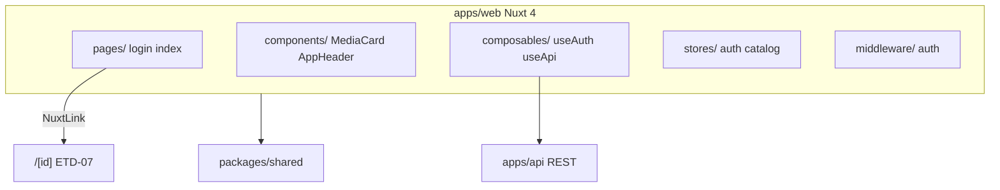

# ETD-06 — Web UI: auth e catálogo

> **Tipo:** Especificação Técnica Detalhada  
> **Identificador:** ETD-06  
> **Status:** Aprovado para implementação  
> **Pré-requisito:** ETD-03 (auth API) + ETD-04 (Video API REST) + ETD-05 (admin operacional) + ao menos 1 vídeo `ready` no catálogo

---

## 1. Visão e escopo

Esta ETD cobre **`apps/web`**: scaffold Nuxt 4, login viewer, middleware de auth e **catálogo** de vídeos prontos — primeira metade da iter-05 (web UI).

| Superfície | Entregável |
|------------|------------|
| `apps/web` | Scaffold Nuxt 4, auth client, home catálogo |
| Páginas | `/login`, `/` |
| Composables | `useAuth`, `useApi` |
| Componentes | `MediaCard`, layout web, estados empty/loading/error |

**Meta funcional:** viewer autenticado acessa `/` e vê grid de vídeos `ready`; clique navega para `/[id]` (player — ETD-07).

**Fora desta ETD:** player HLS (`/[id]` reprodução — ETD-07), WebSocket, progresso assistido, busca/filtros, Sentry, tema claro (admin usa Pêssego claro; web usa **escuro**).

**Validação mínima:**

- Redirect não autenticado → `/login`
- Login seed → `/` com token em memória
- `GET /videos?status=ready` popula grid
- Estados skeleton, vazio e erro funcionam
- Card clicável → `/[id]`

**Requisitos de negócio incorporados:**

| ID | Essência |
|----|----------|
| US-USR-003 | Login viewer, refresh automático, logout, copy erros, WCAG AA, responsivo |
| US-VID-008 | Grid `ready` only, paginação, placeholder thumbnail, estados loading/empty/error |

**Referência visual:** mockup `apps/web/mockups/dc.html` — seções **01 · Login** e **02 · Catálogo**; tema **escuro**.

---

## 2. Arquitetura



### 2.1 Regras de dependência

| Permitido | Proibido |
|-----------|----------|
| `apps/web` → `packages/shared` | `apps/web` → `apps/api`, `apps/admin`, `packages/worker` |
| HTTP para API via URL configurável | Import de código de outro app |

Padrão auth idêntico ao admin (ETD-05): token em memória, refresh via cookie, interceptor 401.

### 2.2 Fluxos

**Auth:** middleware protege `/` e `/[id]`; redirect `/login?redirect=...`; pós-login → `/` ou redirect válido.

**Catálogo:** mount → `GET /videos?status=ready&page=1&limit=20`; paginação via `meta`; sem WebSocket no v0.

---

## 3. Stack e estrutura de arquivos

### 3.1 Stack

| Componente | Escolha |
|------------|---------|
| Framework | **Nuxt 4**, Vue 3, TypeScript strict |
| Runtime | Node ≥ 20 |
| Estado | Pinia via `@pinia/nuxt` — `auth`, `catalog` |
| Estilo | **Tailwind CSS 4** via `@nuxtjs/tailwindcss` — utility-first; tokens §4 em `tailwind.config.ts` |
| Fonte | Plus Jakarta Sans (`@nuxtjs/google-fonts` ou link no `nuxt.config`) |
| HTTP | `$fetch` / `ofetch` com wrapper autenticado |

### 3.2 Estrutura de diretórios (Nuxt 4)

Nuxt 4 usa **`app/`** como `srcDir` padrão — código Vue separado de config e de `server/` na raiz do app.

```
apps/web/
├── nuxt.config.ts
├── tailwind.config.ts
├── package.json              # nuxt ^4, @pinia/nuxt, @nuxtjs/tailwindcss
├── public/                   # favicon, assets estáticos (rootDir)
├── mockups/dc.html           # referência visual — não importado em runtime
└── app/
    ├── app.vue               # Shell raiz
    ├── assets/css/main.css   # @import "tailwindcss"
    ├── pages/
    │   ├── index.vue         # Catálogo /
    │   └── login.vue
    ├── layouts/
    │   ├── default.vue       # Header + slot
    │   └── auth.vue          # Login split
    ├── middleware/auth.global.ts
    ├── stores/auth.ts
    ├── stores/catalog.ts
    ├── composables/useAuth.ts
    ├── composables/useApi.ts
    ├── components/           # auto-import
    └── utils/format.ts
```

| Caminho | Propósito |
|---------|-----------|
| `nuxt.config.ts` | Env públicas, módulos, `css`, porta dev 3001 |
| `app/app.vue` | `<NuxtLayout>` + `<NuxtPage>` |
| `app/layouts/auth.vue` | Split hero + form login |
| `app/layouts/default.vue` | AppHeader + `<slot />` |
| `app/pages/login.vue` | Tela login — `layout: 'auth'` |
| `app/pages/index.vue` | Catálogo — `layout: 'default'` |
| `app/middleware/auth.global.ts` | Guard rotas protegidas |
| `app/stores/auth.ts` | Pinia — token, user, login/logout/refresh |
| `app/stores/catalog.ts` | Pinia — lista, meta, status UI |
| `app/composables/useAuth.ts` | Facade auth + redirect |
| `app/composables/useApi.ts` | Client HTTP + Bearer + refresh |
| `app/components/AppHeader.vue` | Logo, nav pill, avatar, logout |
| `app/components/MediaCard.vue` | Card catálogo clicável |
| `app/components/CatalogGrid.vue` | Grid responsivo de cards |
| `app/components/EmptyState.vue` | Catálogo vazio |
| `app/components/LoadingSkeleton.vue` | Skeleton grid |
| `app/components/Pagination.vue` | Controles paginação |
| `app/utils/format.ts` | Datas, duração, gradientes |

Rota `/[id]` e player — **ETD-07** (`app/pages/[id].vue`).

Alias `~` aponta para `app/` — `~/components/...` resolve corretamente.

### 3.3 Convenções Nuxt 4

| Tópico | Regra |
|--------|-------|
| Scaffold | `pnpm dlx nuxi@latest init web` com template Nuxt 4 |
| Módulos | `@pinia/nuxt`, `@nuxtjs/tailwindcss`; dev: `@nuxt/eslint` opcional |
| Auto-imports | `components/`, `composables/`, `utils/` — sem imports manuais |
| Layout por page | `definePageMeta({ layout: 'auth' })` em login; default implícito em index |
| Data fetching | `useFetch` / `useAsyncData` com `key` explícita (ex.: `'catalog-ready'`) |
| Reatividade fetch | `data` é `shallowRef` — mutações profundas exigem reassign ou `refreshNuxtData` |
| Valor inicial | `data`/`error` default **`undefined`** (não `null`) — checar com `=== undefined` |
| Catálogo | `useFetch` na page index; refetch paginação via `refresh()` ou query params reativos |
| Auth bootstrap | Plugin client (`plugins/auth.client.ts`) opcional — restaura sessão via refresh antes do middleware |
| SSR | `ssr: true` default; catálogo pode SSR shell; token Bearer só após bootstrap client |
| Middleware | `auth.global.ts` — rotas públicas: `/login` only; demais exigem token |
| TypeScript | Projetos TS separados (app/server) gerados pelo Nuxt 4 — `.nuxt/` no gitignore |
| Shared types | Importar enums/DTOs de `@playplus/shared` quando existirem |

**Padrão page catálogo:**

- `definePageMeta({ middleware: [] })` — auth global já protege
- `const page = ref(1)` reativo → watch → `refresh()`
- Loading: `pending` do `useFetch` OU status da store catalog

**Padrão page login:**

- `layout: 'auth'`
- Preservar `route.query.redirect` e `route.query.reason`
- Pós-login: `navigateTo(redirect || '/')`

### 3.4 Variáveis de ambiente

| Variável | Uso | Exemplo dev |
|----------|-----|-------------|
| `NUXT_PUBLIC_API_URL` | Base REST | `http://localhost:3000/v1` |
| `NUXT_PUBLIC_WEB_URL` | Self URL (opcional) | `http://localhost:3001` |

Cookie refresh: enviado automaticamente pelo browser em chamadas same-site à API (`credentials: 'include'`).

Dev server web: porta **3001** (admin tipicamente 3002 — documentar no README root).

### 3.5 Tailwind CSS

**Módulo:** `@nuxtjs/tailwindcss` registrado em `nuxt.config.ts`. CSS entry: `app/assets/css/main.css`.

**Convenções:**

| Regra | Detalhe |
|-------|---------|
| Utility-first | Páginas e componentes usam classes Tailwind no template |
| Primitivos `Pl*` | Variantes encapsuladas com `@apply` em `<style>` do SFC — prefixo compartilhado com admin |
| Sem CSS modules | Não usar `.module.css` no v0 |
| Sem inline `style=` | Exceto valores dinâmicos (ex.: gradiente por hash de `id` na capa) |
| Responsivo | Prefixos `sm:`, `lg:`, `xl:` — login split hero em `md:flex` |
| Dark mode | Tema escuro **fixo** no v0 — sem toggle `dark:` |
| Plugins | `@tailwindcss/forms` (opcional) para reset leve de inputs |

**`tailwind.config.ts` — `theme.extend` (mapeamento §4):**

| Chave Tailwind | Token / valor | Uso típico |
|----------------|---------------|------------|
| `colors.night.canvas` | `#14100D` | `bg-night-canvas` — fundo página |
| `colors.night.panel` | `#1B1511` | `bg-night-panel` — header, painel login |
| `colors.night.surface` | `#1F1813` | `bg-night-surface` — cards |
| `colors.night.elevated` | `#241D17` | `bg-night-elevated` — inputs, pills inativas |
| `colors.night.skeleton` | `#2A231E` | `bg-night-skeleton` — skeleton blocks |
| `colors.night.border` | `#2C231D` | `border-night-border` |
| `colors.night.border-subtle` | `#322620` | bordas secundárias, avatar pill |
| `colors.night.border-input` | `#382C24` | borda input default |
| `colors.night.text` | `#F5EEE8` | `text-night-text` — primário |
| `colors.night.text-secondary` | `#C7BBB1` | labels form |
| `colors.night.text-muted` | `#9A8C82` | meta, subtítulos |
| `colors.night.text-dim` | `#8A7B6F` | section labels mockup |
| `colors.night.text-link` | `#B59C8C` | toggle "mostrar" senha |
| `colors.night.accent` | `#E89B8E` | destaque pêssego, alert info |
| `colors.night.accent-sand` | `#F3C9A6` | gradientes capa |
| `colors.feedback.error-bg` | `rgba(176,65,60,.16)` | alerts erro |
| `colors.feedback.error-border` | `rgba(216,138,133,.4)` | borda alert |
| `colors.feedback.error-text` | `#E89890` | texto erro |
| `colors.feedback.info-bg` | `rgba(232,155,142,.12)` | sessão expirada |
| `colors.feedback.info-border` | `rgba(232,155,142,.35)` | borda info |
| `borderRadius.pl-sm` … `pl-xl` | 11–24px | reutilizar escala ETD-05 |
| `boxShadow.night-panel` | `0 24px 60px rgba(0,0,0,.45)` | painéis login, app shell |
| `boxShadow.night-card` | `0 6px 20px rgba(0,0,0,.25)` | play icon overlay |
| `fontFamily.sans` | Plus Jakarta Sans | `font-sans` |
| `fontSize.pl-xs` … `pl-hero` | escala §4.2 | tipografia |
| `letterSpacing.pl-tight` | `-0.02em` | títulos |
| `backgroundImage.hero-login` | `#F4CDA9 → #EC9E84 → #E07E7A` | hero esquerdo login |
| `backgroundImage.cta-gradient` | `#F0B894 → #E07E7A` | botão Entrar, paginação ativa |

**Exemplos de classes por componente:**

| Componente | Classes Tailwind (referência) |
|------------|-------------------------------|
| Page bg | `min-h-screen bg-night-canvas text-night-text font-sans` |
| Botão CTA login | `h-[52px] rounded-pl-md bg-cta-gradient text-[#2A1410] font-extrabold text-[15.5px] disabled:opacity-60` |
| Input dark | `h-[50px] rounded-pl-md border-[1.5px] border-night-border-input bg-night-elevated px-4 text-[15px] text-night-text placeholder:text-night-text-muted` |
| Input error | `border-feedback-error-border bg-[#2A1F1B]` |
| Alert erro | `flex items-center gap-3 rounded-pl-md bg-feedback-error-bg border border-feedback-error-border p-3.5 role="alert"` |
| Nav pill ativo | `h-[38px] rounded-full bg-[#2A211B] px-3.5 text-pl-sm font-bold text-night-text` |
| Avatar pill | `flex items-center gap-2 rounded-full bg-night-elevated border border-night-border-subtle py-0.5 pl-0.5 pr-3.5` |
| MediaCard outer | `rounded-pl-lg bg-night-surface border border-night-border overflow-hidden transition hover:border-night-border-subtle focus-visible:ring-2 focus-visible:ring-night-accent` |
| Card capa | `relative h-[188px] flex items-center justify-center` |
| Badge duração | `absolute bottom-2 right-2 rounded-[7px] bg-[rgba(20,10,8,.78)] px-[7px] py-[3px] text-[11px] font-bold text-white` |
| Paginação ativa | `size-9 rounded-[10px] bg-cta-gradient text-[#2A1410] font-extrabold text-pl-xs` |
| Paginação inativa | `size-9 rounded-[10px] bg-night-elevated border border-night-border-subtle text-[#B5A89E]` |
| Empty icon box | `size-[72px] rounded-[22px] bg-night-elevated border border-night-border-subtle` |

**Grid catálogo:** `grid grid-cols-1 sm:grid-cols-2 lg:grid-cols-3 xl:grid-cols-3 gap-[22px]`.

**Animações:** spinner `animate-spin`; skeleton `animate-pulse`. Respeitar reduced motion — spinners substituídos por texto estático quando `prefers-reduced-motion: reduce`.

---

## 4. Design system — recursos de UI

Tokens visuais abaixo são a **fonte de verdade** — implementados em `tailwind.config.ts` e consumidos via classes Tailwind (§3.5).

### 4.1 Princípios

| Princípio | Regra |
|-----------|-------|
| Tom | Pessoal e acolhedor — cinema particular, não streaming corporativo |
| Contraste admin/web | Admin **claro** (Pêssego); web **escuro** (Night) — mesma identidade, superfícies invertidas |
| Destaque | Gradiente pêssego (`cta-gradient`, hero login) pontua ações em fundo escuro |
| Status | Sempre **ícone + texto** quando aplicável — nunca cor isolada |
| Cantos | Suaves — radius 14–24 px (`pl-md` … `pl-xl`) |
| Motion | Spinners discretos; respeitar `prefers-reduced-motion` |
| Densidade | Catálogo em **grid de cards** verticais — vídeo em destaque na capa |
| Foco | Capa + play overlay convidam ao clique; metadados compactos abaixo |

### 4.2 Tipografia

| Token | Valor | Classe Tailwind (exemplo) |
|-------|-------|----------------------------|
| Família | `'Plus Jakarta Sans', system-ui, sans-serif` | `font-sans` |
| Pesos | 400, 500, 600, 700, 800 | `font-normal` … `font-extrabold` |
| `pl-xs` | 11–12.5px — badge duração, meta card | `text-pl-xs` |
| `pl-sm` | 13–13.5px — labels, nav, alerts | `text-pl-sm` |
| `pl-base` | 14–15px — corpo, inputs, título card | `text-pl-base` |
| `pl-lg` | 17–18px — wordmark header | `text-pl-lg` |
| `pl-xl` | 25–26px — título página catálogo | `text-pl-xl` |
| `pl-hero` | 28px — headline hero login | `text-pl-hero` |
| Letter-spacing títulos | `-0.02em` | `tracking-pl-tight` |
| Section labels mockup | `0.14em`, weight 800, 13px | `text-pl-sm font-extrabold uppercase tracking-widest text-night-text-dim` |

### 4.3 Paleta — tema Night

| Token | Hex | Classe | Uso |
|-------|-----|--------|-----|
| `night.canvas` | `#14100D` | `bg-night-canvas` | fundo página, outer shell |
| `night.panel` | `#1B1511` | `bg-night-panel` | header, painel login form |
| `night.surface` | `#1F1813` | `bg-night-surface` | cards catálogo |
| `night.elevated` | `#241D17` | `bg-night-elevated` | inputs, pills, botões secundários |
| `night.skeleton` | `#2A231E` | `bg-night-skeleton` | blocos skeleton |
| `night.border` | `#2C231D` | `border-night-border` | divisores, borda card |
| `night.border-subtle` | `#322620` | — | avatar pill, empty state |
| `night.border-input` | `#382C24` | — | borda input |
| `night.text` | `#F5EEE8` | `text-night-text` | texto primário |
| `night.text-secondary` | `#C7BBB1` | — | labels |
| `night.text-muted` | `#9A8C82` | `text-night-text-muted` | subtítulos, meta |
| `night.text-dim` | `#8A7B6F` | — | section labels |
| `night.accent` | `#E89B8E` | `text-night-accent` | ícones destaque |
| `hero-login` | gradiente pêssego | `bg-hero-login` | painel esquerdo login |
| `cta-gradient` | `#F0B894 → #E07E7A` | `bg-cta-gradient` | Entrar, paginação ativa |

**Feedback:**

| Tipo | BG | Borda | Texto |
|------|-----|-------|-------|
| Erro credenciais | `rgba(176,65,60,.16)` | `rgba(216,138,133,.4)` | `#E89890` |
| Sessão expirada | `rgba(232,155,142,.12)` | `rgba(232,155,142,.35)` | `#E89B8E` |
| Erro catálogo | igual erro credenciais | — | — |

**Gradientes capa (placeholder):** determinísticos por hash de `id` — paleta mockup: pêssego `#F3C9A6→#E89B8E`, verde `#CFE6D2→#7FB98C`, lavanda `#D9C9EE→#B9A3E0`, azul `#C9D8F0→#9DBCEC`, neutro `#3A322C→#2A231E` (sem thumbnail).

### 4.4 Espaçamento e radius

| Token | Valor | Uso |
|-------|-------|-----|
| `pl-sm` | 11px | ícone logo header |
| `pl-md` | 14px | inputs, botões |
| `pl-lg` | 18px | cards, capa radius |
| `pl-xl` | 24px | painel login outer |
| pill | 999px | nav Vídeos, avatar, logout |
| Header | 68px | `h-[68px]` fixo |
| Page padding | `px-9 py-7` (36/28px) | corpo catálogo |
| Card meta padding | `14px 16px 16px` | área título abaixo capa |
| Gap grid | 22px | entre MediaCards |

### 4.5 Componentes base (primitivos)

Reutilizar naming `Pl*` do admin — variantes **dark**:

| Componente | Variantes | Spec Tailwind |
|------------|-----------|---------------|
| `PlButton` | cta, secondary, ghost, icon | **cta:** §3.5. **secondary:** `h-11 rounded-pl-md bg-night-elevated border border-night-border-subtle text-night-text font-bold`. **icon:** `size-10 rounded-full bg-night-elevated border border-night-border-subtle` |
| `PlInput` | default, error | §3.5; error: borda feedback + fundo `#2A1F1B` |
| `PlLabel` | — | `text-pl-sm font-semibold text-night-text-secondary mb-2` |
| `PlAlert` | error, info | Error/info conforme §4.3 feedback; sempre `role="alert"` |
| `PlSkeleton` | card, text | `animate-pulse rounded-pl-lg bg-night-skeleton` |
| `PlEmptyState` | catalog | Ícone 72px box + título 20px/800 + subtítulo muted |

### 4.6 Ícones

SVG inline (stroke 2–2.2px, round caps) — sem biblioteca externa no v0.

| Contexto | Ícone |
|----------|-------|
| Logo Play+ | triângulo play em quadrado gradiente pêssego |
| Logout | door-arrow |
| Play overlay card | triângulo branco em círculo 52px |
| Empty catálogo | claquete / vídeo |
| Paginação | ‹ › chevrons |
| Erro | círculo + exclamação |

Botões ícone: `40×40px`, bg `#241D17`, borda `#322620`, `aria-label` obrigatório.

---

## 5. Páginas e layouts

### 5.1 Layout `auth` — Login

Split horizontal (breakpoint ≥ `md`):

| Zona | Largura | Conteúdo |
|------|---------|----------|
| Hero esquerdo | 480px fixo | `bg-hero-login`, logo escuro, 3 poster cards decorativas (96×120–172px, opacidades variadas), headline *"Seu cinema particular."*, sub *"Guarde, assista e retome de onde parou."* |
| Form direito | flex 1 | Fundo `night.panel`, padding 56px, form centralizado verticalmente |

Painel outer: `rounded-pl-xl shadow-night-panel border border-night-border overflow-hidden` — altura ~660px em desktop.

Mobile (`< md`): hero oculto; form full-width com logo compacto gradiente no topo; padding 32px.

**Não exibir** link *"Esqueceu a senha?"* (presente no mockup, fora de escopo US-USR-003).

### 5.2 Página `/login`

| Estado | UI |
|--------|-----|
| Default | Título *"Bem-vindo de volta"*, subtítulo *"Faça login para continuar."*, campos email + senha + toggle **mostrar** + botão **Entrar** |
| Loading | Botão **Entrando…** + spinner 18px; campos disabled; opacity 95% no CTA |
| Erro credenciais | `PlAlert` error: *"E-mail ou senha incorretos."*; input senha com estado error |
| Sessão expirada | Query `?reason=session_expired` → `PlAlert` info pêssego: *"Sua sessão expirou. Faça login novamente."* |
| Erro validação | Mensagens por campo abaixo do input |

Copy campos: label *"E-mail"*, *"Senha"*; toggle senha *"mostrar"* / *"ocultar"* em `text-night-text-link`.

Pós-login: redirect `/` ou `redirect` query se path interno válido (mesma regra admin).

Campos: `autocomplete="email"` / `autocomplete="current-password"`.

Admin seed (role `admin`) deve conseguir login — ADR-004 inclui permissões viewer.

### 5.3 Layout `default` — App autenticado

Shell: `min-h-screen bg-night-canvas flex flex-col`.

**AppHeader** fixo 68px, `bg-night-panel border-b border-night-border px-7`:

| Elemento | Posição | Detalhe Tailwind |
|----------|---------|------------------|
| Logo Play+ | esquerda | Ícone 34×34 `rounded-pl-sm bg-cta-gradient` + wordmark 18px/800 |
| Nav pill **Vídeos** | após logo (+14px) | `rounded-full bg-[#2A211B] h-[38px] px-3.5 text-pl-sm font-bold` — ativo em `/` |
| Spacer | flex 1 | — |
| Avatar + nome | direita | Pill: avatar 34px gradiente `#E89B8E→#C97FB0` + nome `/me` 13.5px/700 |
| Botão logout | direita | `PlButton` icon 40px, ícone door `#9A8C82`, `aria-label="Sair"` |

Sem busca no v0. Mobile: nome pode truncar; logo permanece.

### 5.4 Página `/` — Catálogo

**Cabeçalho de página** (`mb-6`):

| Elemento | Copy / spec |
|----------|-------------|
| Título | *"Meus vídeos"* — `text-pl-xl font-extrabold tracking-pl-tight` |
| Subtítulo | *"{meta.total} vídeo(s)"* — `text-pl-base text-night-text-muted font-medium mt-1` |

**Estados:**

| Estado | UI |
|--------|-----|
| Loading | `LoadingSkeleton` — grid 2×2 (mobile) ou 3 col (desktop); blocos capa + 2 linhas texto |
| Empty | `EmptyState`: box ícone 72px + *"Nenhum vídeo disponível."* (20px/800) + *"Quando um vídeo terminar de processar, ele aparecerá aqui."* |
| Error | `PlAlert` + botão **Tentar novamente** secondary |
| Success | `CatalogGrid` de `MediaCard` |

**Paginação** (quando `meta.total > limit`): controles centrados, gap 8px — ‹ · numeração · ›; página ativa com `bg-cta-gradient`; anterior desabilitado na pág. 1 (`text-[#6A5A50]`).

**API:** `GET /videos?status=ready&page={n}&limit=20` — `pending`/`processing`/`error`/`queued` **nunca** aparecem.

---

## 6. Componentes

### 6.1 `MediaCard`

Card inteiro é `<NuxtLink :to="\`/${id}\`" class="block group">` — foco visível no link.

| Área | Spec |
|------|------|
| Outer | `rounded-pl-lg bg-night-surface border border-night-border overflow-hidden` |
| Capa | `h-[188px]` relativa; `thumbnail_url` com `object-cover w-full h-full` se presente |
| Sem thumbnail | Gradiente `gradientForVideoId(id)` + ícone claquete central `#6A5A50` opacity 70% |
| Overlay inferior | `bg-gradient-to-t from-[rgba(20,10,8,.55)]` a partir de 40% |
| Play overlay | Círculo 52px branco 94% + triângulo play `#231C18` — decorativo (`aria-hidden`) |
| Badge duração | Canto inferior direito — `formatDuration(duration)` |
| Meta block | padding 14/16px |
| Título | 15px/700, truncate 2 linhas max |
| Linha meta | 12.5px muted — `{formatDate(created_at)} · {formatDuration(duration)}` |

Hover: borda `night.border-subtle`; sem barra progresso assistido no v0.

### 6.2 `CatalogGrid`

Wrapper: `grid grid-cols-1 sm:grid-cols-2 lg:grid-cols-3 gap-[22px]`.

Recebe `items: VideoListItem[]` via props ou store.

### 6.3 `LoadingSkeleton`

Replica estrutura do card: capa `h-[120px]` skeleton + 2 barras texto. Grid 2×2 default.

### 6.4 `Pagination`

Props: `page`, `total`, `limit`, `@change`.

Botões 36×36px; `aria-label` *"Página anterior"*, *"Página {n}"*, *"Próxima página"*.

### 6.5 `stores/catalog`

| Campo | Tipo | Uso |
|-------|------|-----|
| `data` | array | Itens da página |
| `meta` | `{ total, page, limit }` | Paginação |
| `status` | `idle \| loading \| error \| empty` | UI state |

### 6.6 Utilitários `format.ts`

| Função | Exemplo |
|--------|---------|
| `formatDuration(seconds)` | `7240` → `2:00:40` ou `12:04` |
| `formatDate(iso)` | `28 mai 2026` |
| `gradientForVideoId(id)` | retorna classes Tailwind gradiente |

---

## 7. Autenticação client

Mesmo contrato da ETD-05 §9 — adaptado para rotas web:

| Rota pública | `/login` |
| Rotas protegidas | `/`, `/[id]` |
| Token | Memória Pinia — **não** localStorage |
| Refresh | Cookie httpOnly + `POST /auth/refresh` |
| Logout | `POST /auth/logout` → `/login` |

Copy de erros (autocontida):

| Code | Mensagem |
|------|----------|
| `UNAUTHORIZED` | E-mail ou senha incorretos. |
| `INVALID_TOKEN` | Sua sessão expirou. Faça login novamente. |

---

## 8. Integração API

| Método | Path | Uso |
|--------|------|-----|
| POST | `/auth/login` | Login |
| POST | `/auth/refresh` | Interceptor |
| POST | `/auth/logout` | Logout |
| GET | `/me` | Nome no header |
| GET | `/videos?status=ready&page&limit` | Catálogo |

Item catálogo (shape listagem ETD-04 §5.6): `id`, `title`, `duration`, `thumbnail_url`, `status`, `created_at`.

---

## 9. Acessibilidade (WCAG 2.1 AA)

| Requisito | Implementação |
|-----------|---------------|
| Login | Igual ETD-05 §10 — labels, `role="alert"`, foco visível |
| Cards | Link com título visível; capa decorativa `alt=""` |
| Paginação | Botões com `aria-label` ("Página anterior") |
| Contraste | Pares `night-text` / `night-canvas` ≥ 4.5:1 |
| Responsivo | Header empilha em viewport estreita |

---

## 10. Blocos de implementação

```
scaffold → auth → catálogo
```

| Bloco | Escopo | Meta |
|-------|--------|------|
| A | Nuxt 4 scaffold, tema night, layouts, `useAuth`, `/login`, middleware | Login funcional |
| B | `MediaCard`, `CatalogGrid`, store catalog, `/`, paginação, estados | Catálogo `ready` navegável |

---

## 11. Verificação

| # | Critério |
|---|----------|
| 1 | Não autenticado em `/` → redirect `/login?redirect=/` |
| 2 | Login válido → `/`; token não está em localStorage |
| 3 | Admin seed consegue login na web |
| 4 | Grid exibe somente vídeos `status: ready` |
| 5 | Catálogo vazio → copy correta |
| 6 | Erro API → **Tentar novamente** refetch |
| 7 | Paginação quando `total > limit` |
| 8 | Click card → navega `/[id]` |
| 9 | Grid responsivo 1→2→3 colunas sem overflow |
| 10 | Logout → catálogo inacessível |

---

## 12. Riscos

| Risco | Mitigação |
|-------|-----------|
| Nenhum vídeo `ready` para testar | Upload admin prévio (ETD-05) |
| Auth SSR vs client | Fetch catálogo após auth bootstrap client |
| Divergência visual admin/web | Tokens separados `peach` vs `night` |

---

## 13. Entregas futuras

| Item | Descrição |
|------|-----------|
| Player HLS | **ETD-07** — `/[id]` |
| Progresso no card | US-WS-001 |
| Busca e filtros | Polish |
| WebSocket catálogo | Atualização live |
| Sentry Nuxt | Observabilidade |

---

*ETD-06 · Play+ v0 · Web auth + catálogo*
