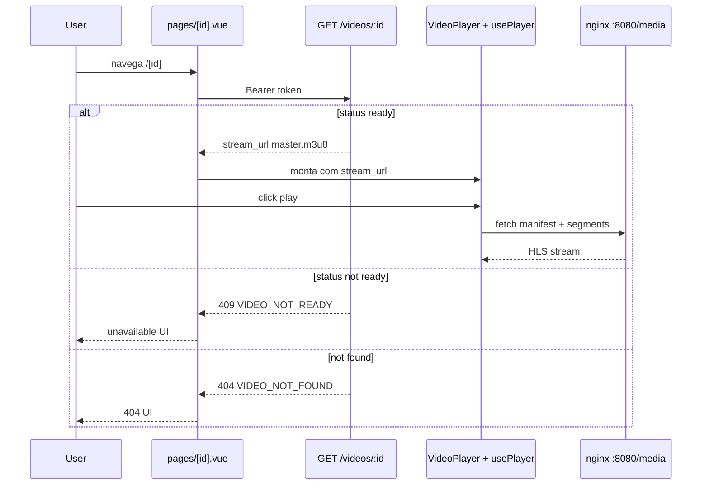

# ETD-07 — Web UI: player HLS

> **Tipo:** Especificação Técnica Detalhada  
> **Identificador:** ETD-07  
> **Status:** Aprovado para implementação  
> **Pré-requisito:** ETD-06 (web auth + catálogo) + pipeline E2E (worker FFmpeg + nginx HLS ADR-003) + ao menos 1 vídeo `ready`

---

## 1. Visão e escopo

Esta ETD cobre a **reprodução HLS** em `apps/web`: página de detalhe `/[id]`, player com `hls.js`, estados de indisponibilidade e milestone final do vertical slice v0.

| Superfície | Entregável |
|------------|------------|
| `apps/web` | `pages/[id].vue`, `VideoPlayer`, `usePlayer` |
| Rota | `/[id]` — deep link ou entrada via catálogo |
| Integração | `GET /videos/:id` → `stream_url` (`master.m3u8`) |

**Meta funcional:** viewer autenticado reproduz vídeo `ready` com play/pause/seek, ABR adaptativo e estados de erro recuperáveis.

**Milestone v0:** upload admin → transcode → assistir web (primeiro fluxo ponta a ponta).

**Fora desta ETD:** retomada automática (`watch_progress`), WebSocket `player.progress`, menu manual de qualidade (opcional), velocidade de reprodução, legendas, PiP, Sentry.

**Requisitos de negócio incorporados:**

| ID | Essência |
|----|----------|
| US-VID-009 | Player HLS, estados por status, 404, buffering, a11y, responsivo, sem autoplay com som |

**Referência visual:** mockup `apps/web/mockups/dc.html` — seção **03 · Player**; tokens `night.*` da ETD-06.

---

## 2. Arquitetura



### 2.1 Entrega HLS (ADR-003 — resumo)

Em dev, segmentos HLS são servidos via **nginx reverse proxy** — não diretamente do MinIO.

| Item | Valor dev |
|------|-----------|
| URL pública | `http://localhost:8080/media/{storage_key}` |
| Exemplo `stream_url` | `http://localhost:8080/media/videos/{videoId}/hls/master.m3u8` |
| API | Monta URL com `CDN_BASE_URL` + storage key |
| CORS | nginx centraliza origens `localhost:3000`, `3001`, `3002` |
| Prod | `CDN_BASE_URL` → Cloudflare na frente do R2 — mesma forma de URL |

Player consome `stream_url` retornado pela API — **nunca** monta path manualmente.

### 2.2 Regras

| Permitido | Proibido |
|-----------|----------|
| `hls.js` em Chrome/Firefox/Edge | Autoplay com som |
| HLS nativo em Safari (`video.canPlayType`) | Credenciais storage no client |
| Retry de segmento via `usePlayer` | Polling de status transcode |

---

## 3. Stack, Nuxt 4 e Tailwind

### 3.1 Dependências adicionais

| Pacote | Uso |
|--------|-----|
| `hls.js` | Playback HLS em browsers sem suporte nativo |
| — | Safari: `<video src>` direto no manifest (detecção em `usePlayer`) |

**Não usar** `@nuxtjs/video-player` no v0 — controle fino de a11y e estados custom exige componente próprio.

### 3.2 Arquivos novos (ETD-07)

```
apps/web/app/
├── pages/[id].vue              # Detalhe + player wrapper
├── components/VideoPlayer.vue  # Stage + controles
├── components/PlayerControls.vue
├── components/PlayerScrubber.vue
├── components/PlayerUnavailable.vue
├── components/PlayerNotFound.vue
├── composables/usePlayer.ts
└── composables/useVideoDetail.ts
```

Reutiliza de ETD-06: `useAuth`, `useApi`, `format.ts`, tokens `night.*`, primitivos `Pl*`.

### 3.3 Convenções Nuxt 4 — página player

| Tópico | Regra |
|--------|-------|
| Rota dinâmica | `app/pages/[id].vue` — param `route.params.id` |
| Layout | `default` com header player (Voltar + logo) — **variante** do AppHeader ou header inline na page |
| Data fetch | `useVideoDetail(id)` composable — `useFetch(\`video-${id}\`, () => GET /videos/:id)` |
| Client-only player | `<ClientOnly>` envolvendo `VideoPlayer` **ou** `onMounted` para init hls — evita SSR mismatch |
| Watch route | Se `[id]` muda, destroy player anterior + refetch metadados |
| Error handling | Mapear status HTTP + body `error.code` → enum page state |
| Deep link | Admin abre `NUXT_PUBLIC_WEB_URL/{id}` — middleware auth redireciona login se necessário |
| SEO v0 | `useHead({ title: video?.title ?? 'Play+' })` quando metadados carregados |

**Estados derivados:** computed a partir de `data`, `error`, `pending` do fetch — não duplicar lógica no template.

### 3.4 Tailwind — superfície player

Estende tokens ETD-06 §3.5 / §4.3. Classes adicionais:

| Uso | Classes Tailwind (referência) |
|-----|-------------------------------|
| Stage container | `relative w-full aspect-video rounded-pl-lg overflow-hidden bg-night-surface` |
| Vignette overlay | `absolute inset-0 bg-[radial-gradient(circle_at_50%_42%,transparent_30%,rgba(10,6,16,.45)_100%)]` |
| Control bar gradient | `absolute inset-x-0 bottom-0 bg-gradient-to-t from-[rgba(10,6,4,.78)] to-transparent px-[18px] pb-3.5 pt-4` |
| Play central idle | `size-[84px] rounded-full bg-white/16 backdrop-blur-sm border-[1.5px] border-white/45` |
| Scrubber track | `h-1.5 flex-1 rounded-full bg-white/22 relative` |
| Scrubber fill | `absolute inset-y-0 left-0 rounded-full bg-cta-gradient` — width via `:style` |
| Scrubber thumb | `absolute size-[15px] rounded-full bg-white shadow-md top-1/2 -translate-y-1/2` |
| Play/pause FAB | `size-[46px] rounded-full bg-white text-[#231C18]` |
| Time labels | `text-xs font-bold text-night-text tabular-nums` |
| Badge qualidade | `absolute top-4 left-[18px] flex items-center gap-2 rounded-full bg-[rgba(20,10,8,.5)] backdrop-blur-sm px-3 py-1.5` |
| Badge dot verde | `size-[7px] rounded-full bg-[#8FD9A4]` |
| Buffering spinner | `size-9 rounded-full border-[3px] border-white/20 border-t-night-text motion-safe:animate-spin` |
| Erro HLS panel | `rounded-[14px] bg-feedback-error-bg border border-feedback-error-border p-3.5` |
| Botão Voltar header | `flex items-center gap-2 text-pl-sm font-semibold text-night-text-muted hover:text-night-text` |
| Título abaixo stage | `text-[23px] font-extrabold tracking-pl-tight` |
| Meta linha | `text-[13.5px] text-night-text-muted font-medium mt-1.5` |
| Unavailable center | `flex flex-col items-center text-center px-10 py-10` |
| Unavailable icon box | `size-[72px] rounded-[22px] bg-night-elevated border border-night-border-subtle mb-5` |
| 404 decorativo | `text-[48px] font-extrabold text-[#322620] leading-none` |

**Placeholder stage sem poster:** gradiente lavanda mockup `from-[#3A2E5C] via-[#5A4A86] to-[#8A6FA8]`.

**Reduced motion:** buffering usa texto *"Carregando…"* estático quando `prefers-reduced-motion: reduce`; spinner com `motion-safe:animate-spin`.

---

## 4. Design system — player UI

### 4.1 Princípios

| Princípio | Regra |
|-----------|-------|
| Vídeo primeiro | Stage ocupa largura máxima do content area; metadados secundários abaixo |
| Controles sobre vídeo | Barra inferior com gradiente — legível em qualquer frame |
| Sem layout shift | Stage reserva `aspect-video` desde skeleton; buffering overlay absoluto |
| Gestos explícitos | Play só após click/teclado — poster visível antes |
| Feedback claro | Estados unavailable centralizados; erros HLS dentro do stage |
| Consistência | Mesmo header/back pattern em todos os estados da page |

### 4.2 Anatomia do stage (mockup §03)

```
┌─────────────────────────────────────────────┐
│ [1080p · HD ●]                    (badge)   │
│                                             │
│              ( poster / vídeo )             │
│                 [ ▐▐ play ]                 │
│                                             │
│ 07:32 ═══════●══════════════ 12:04          │
│ ⏮  (▐▐)  ⏭  🔊          ⚙  ⛶              │
└─────────────────────────────────────────────┘
  Título do vídeo
  Adicionado em 28 mai 2026 · 12:04
```

| Zona | Dimensão / spec |
|------|-----------------|
| Stage | `aspect-video`, `rounded-pl-lg` (18px) |
| Badge qualidade | top 16px, left 18px |
| Play central (idle) | 84px diâmetro |
| Control bar | padding 16px 18px 14px bottom |
| Scrubber | track 6px; thumb 15px |
| FAB play/pause | 46px branco |
| Ícones secundários | 20–22px stroke `#F5EEE8` |
| Settings ícone | decorativo v0 — sem menu funcional obrigatório |

### 4.3 Header player

Variante do catálogo — **sem nav pill Vídeos**; foco na navegação back:

| Elemento | Spec |
|----------|------|
| Voltar aos vídeos | Link `←` + texto; `NuxtLink to="/"` |
| Logo Play+ | Direita (mockup) ou centro — manter consistência com mockup: back esquerda, logo direita |
| Altura | 68px, `bg-night-panel border-b border-night-border` |

Presente em **todos** os estados (loading, unavailable, 404, error) exceto 404 full onde header pode ser mínimo.

### 4.4 Estados visuais — mapa mockup

| Mockup panel | Page state | Monta VideoPlayer? |
|--------------|------------|-------------------|
| Reprodução · controles | `ready` + playing/paused | Sim |
| Carregando metadados | `loading` | Não — skeleton stage |
| Buffering HLS | `ready` + buffering | Sim — overlay spinner |
| Não pronto · processing | `unavailable_processing` | Não |
| 404 | `not_found` | Não |
| Erro segmento | `ready` + `error_hls` | Sim — overlay erro |

---

## 5. Página `/[id]`

### 5.1 Layout da page

Content area: `flex-1 px-6 py-6 lg:px-8` — stage full-width dentro de max container opcional.

Estrutura vertical:

1. Header player (§4.3)
2. Stage ou skeleton ou unavailable/404 center
3. Bloco metadados (título + linha) — visível quando metadados carregados, inclusive em erro HLS

### 5.2 Fetch de metadados

`GET /videos/:id` com Bearer.

**Resposta `ready` (campos relevantes):** `id`, `title`, `duration`, `thumbnail_url`, `status`, `stream_url`, `created_at`.

### 5.3 Máquina de estados da página

| Estado | Condição | UI |
|--------|----------|-----|
| `loading` | Fetch em andamento | Skeleton stage + linhas título |
| `ready` | `status: ready` + metadados OK | `VideoPlayer` montado |
| `unavailable_processing` | `pending` / `processing` ou 409 | *"Este vídeo ainda está sendo preparado."* |
| `unavailable_queued` | `status: queued` | *"Este vídeo está na fila de processamento."* |
| `unavailable_error` | `status: error` | *"Este vídeo não está disponível para reprodução."* |
| `not_found` | 404 `VIDEO_NOT_FOUND` | *"Vídeo não encontrado."* + 404 decorativo |
| `error_api` | Falha rede/5xx no fetch | *"Não foi possível carregar os detalhes do vídeo."* + **Tentar novamente** |

Estados `unavailable_*` e `not_found`: **não montar** `VideoPlayer`; CTA **Voltar aos vídeos** — botão secondary `h-11 rounded-pl-md bg-night-elevated border border-night-border-subtle px-5 font-bold`.

**Unavailable UI** (mockup processing):

- Ícone relógio pêssego em box 72px
- Mensagem 18px/800, max-width 320px, centered
- CTA abaixo com margin-top 24px

**404 UI:**

- Número `404` decorativo 48px cor `#322620`
- *"Vídeo não encontrado."* 18px/800
- CTA Voltar

Deep link do admin (`NUXT_PUBLIC_WEB_URL/{id}`) deve funcionar para todos os estados.

### 5.4 Metadados abaixo do player

| Campo | Formato Tailwind |
|-------|------------------|
| `title` | `text-[23px] font-extrabold tracking-pl-tight text-night-text` |
| Linha secundária | `text-[13.5px] text-night-text-muted font-medium` — *"Adicionado em {formatDate(created_at)} · {formatDuration(duration)}"* |

Padding-top 20px entre stage e título. Visível em estados `ready` (incl. error HLS) e buffering.

Não exibir `file_size`, `storage_key` ou campos internos.

### 5.5 Skeleton loading

Replica stage + metadados (mockup):

- Stage: bloco `rounded-pl-lg bg-night-skeleton min-h-[280px] flex-1`
- Título: barra 70% width 24px height
- Meta: barra 45% width 14px height
- Header: barra 120px placeholder back link

---

## 6. Componente `VideoPlayer`

### 6.1 Stage

| Propriedade | Spec |
|-------------|------|
| Container | `relative aspect-video rounded-pl-lg overflow-hidden bg-night-surface` |
| `<video>` | `absolute inset-0 w-full h-full object-contain bg-black`; `playsinline`, `preload="metadata"`, **sem** `autoplay` |
| Poster | `:poster="thumbnail_url"` ou div gradiente placeholder atrás do video |
| Vignette | Radial gradient overlay — §3.4 |
| Control bar | Absolute bottom — §4.2 |

### 6.2 Estados internos do player

| Estado | UI |
|--------|-----|
| `idle` (pausado, nunca reproduziu) | Poster/thumbnail + botão play central 84px (pause bars brancas decorativas no mockup) |
| `playing` | Vídeo ativo; FAB mostra pause; controles visíveis |
| `paused` | Frame atual; FAB play; controles visíveis |
| `buffering` | Overlay absoluto inset-0 flex center; spinner + *"Carregando…"* 13px/600 — **sem** alterar height do stage |
| `error_hls` | Overlay com `PlAlert` compacto + botão **Tentar novamente** CTA gradiente |

Playback inicia **somente** após gesto explícito (click play ou teclado).

Controles permanecem acessíveis em viewport estreita — barra pode wrap em duas linhas abaixo de 360px width.

### 6.3 Controles (barra inferior)

| Controle | Comportamento | aria-label |
|----------|---------------|------------|
| Play / Pause (FAB) | Toggle central na barra | *"Reproduzir"* / *"Pausar"* |
| Play overlay (idle) | Click inicia playback | *"Reproduzir vídeo"* |
| Voltar 10s | `currentTime -= 10` | *"Voltar 10 segundos"* |
| Avançar 10s | `currentTime += 10` | *"Avançar 10 segundos"* |
| Scrubber | Seek absoluto — §7 | slider a11y |
| Volume | Mute toggle + slider compacto | *"Ativar som"* / *"Silenciar"* |
| Fullscreen | `requestFullscreen` no container stage | *"Tela cheia"* |
| Settings | Decorativo v0 | *"Configurações"* (disabled ou noop) |

Tempos: `currentTime` / `duration` — `font-variant-numeric: tabular-nums`, formato `mm:ss` ou `h:mm:ss`.

Layout barra: scrubber row acima; botões row abaixo com `gap-[18px]`; spacer flex antes de settings/fullscreen.

### 6.4 Qualidade ABR

**Obrigatório:** ABR via `master.m3u8` — `hls.js` seleciona rendição conforme banda.

**Opcional v0:** menu manual 240p–1080p. Se não implementado:

- Badge informativo canto superior esquerdo: `{height}p · HD` (somente leitura)
- `aria-label`: *"Qualidade atual: 1080p"*
- Indicador verde 7px ao lado do label

Atualizar badge em evento `hls.js` `LEVEL_SWITCHED`.

### 6.5 Início da reprodução

Sem WatchSession no v0: sempre **0:00** — sem retomada automática.

### 6.6 `PlayerScrubber`

Componente dedicado — props: `currentTime`, `duration`, `@seek`.

| Prop a11y | Valor |
|-----------|-------|
| `role` | `slider` |
| `aria-valuemin` | `0` |
| `aria-valuemax` | `duration` |
| `aria-valuenow` | `currentTime` |
| `aria-valuetext` | *"{tempo atual} de {duração total}"* |

Interação: click na track → seek; drag thumb (pointer events); teclado ←/→ quando focado (±5s ou ±10s).

### 6.7 `PlayerUnavailable` / `PlayerNotFound`

Componentes presentacionais — recebem `variant: 'processing' | 'queued' | 'error' | 'not_found'` e emitem `@back`.

Copy e layout conforme §5.3 e §9 — sem lógica de fetch.

---

## 7. `usePlayer` — lógica HLS

### 7.1 Detecção de engine

```
if (video.canPlayType('application/vnd.apple.mpegurl'))
  → Safari/iOS: src direto no <video>
else if (Hls.isSupported())
  → hls.js: new Hls({ enableWorker: true })
else
  → estado error: browser não suportado
```

### 7.2 Lifecycle

| Evento | Ação |
|--------|------|
| Mount + `stream_url` | Attach media; **não** auto-play |
| User play | `video.play()`; hls startLoad se needed |
| Unmount | `hls.destroy()`; pause video; revoke listeners |
| `HLS_ERROR` fatal | → estado `error_hls` |
| `HLS_ERROR` non-fatal network | retry interno hls.js; após esgotar → `error_hls` |

### 7.3 Retry recuperável

**Tentar novamente:** destruir instância hls, resetar `<video>`, reattach manifest, manter posição desejada se possível (ou reiniciar do zero v0).

### 7.4 Performance

Time-to-first-frame ≤ 5 s em dev local (após gesto play) para vídeo de teste transcodificado.

---

## 8. Acessibilidade (WCAG 2.1 AA)

| Requisito | Implementação |
|-----------|---------------|
| Controles | `aria-label`: *"Reproduzir"*, *"Pausar"*, *"Voltar 10 segundos"*, *"Avançar 10 segundos"*, *"Tela cheia"* |
| Scrubber | `PlayerScrubber` §6.6 — `role="slider"`, `aria-valuemin="0"`, `aria-valuemax="{duration}"`, `aria-valuenow`, `aria-valuetext` |
| Teclado | Space/K → play/pause; ←/→ seek ±10s; F → fullscreen (quando foco no player) |
| Erros | `role="alert"` ou `aria-live="assertive"` |
| Contraste | Overlays controles ≥ 4.5:1 |
| Reduced motion | `@media (prefers-reduced-motion: reduce)` — spinner estático ou opacidade pulse mínima |
| Autoplay | Sem som automático (WCAG 1.4.2) |

Botão play central: `aria-label="Reproduzir vídeo"`.

---

## 9. Copy de UI (autocontida)

| Situação | Mensagem | Ação |
|----------|----------|------|
| Loading metadados | — (skeleton) | — |
| Buffering HLS | Carregando… (spinner) | — |
| `processing` / `pending` | Este vídeo ainda está sendo preparado. | Voltar aos vídeos |
| `queued` | Este vídeo está na fila de processamento. | Voltar aos vídeos |
| `error` (status vídeo) | Este vídeo não está disponível para reprodução. | Voltar aos vídeos |
| 404 | Vídeo não encontrado. | Voltar aos vídeos |
| Falha HLS | Não foi possível carregar o vídeo. | Tentar novamente |
| Falha API metadados | Não foi possível carregar os detalhes do vídeo. | Tentar novamente |
| Navegação | Voltar aos vídeos | link `/` |

---

## 10. Integração API

| Método | Path | Respostas relevantes |
|--------|------|----------------------|
| GET | `/videos/:id` | 200 + `stream_url` se `ready` |
| | | 409 `VIDEO_NOT_READY` se não `ready` |
| | | 404 `VIDEO_NOT_FOUND` |

Shape erro: `{ "error": { "code": "...", "message": "..." } }`.

Mapeamento 409 → UI `unavailable_*` conforme `status` no body se presente, ou mensagem genérica processing.

---

## 11. Blocos de implementação

```
detalhe → player → a11y → validação E2E
```

| Bloco | Escopo | Meta |
|-------|--------|------|
| A | `[id].vue`, fetch, estados loading/unavailable/404/error API | Página completa sem playback |
| B | `usePlayer`, `VideoPlayer`, controles, buffering, poster | Play HLS funcional |
| C | Scrubber a11y, teclado, reduced-motion, badge ABR | WCAG AA player |
| D | Roteiro E2E manual documentado | Milestone v0 validado |

---

## 12. Verificação

| # | Critério |
|---|----------|
| 1 | Vídeo `ready`: metadados carregam; player monta; play inicia stream |
| 2 | Sem autoplay com som ao abrir página |
| 3 | Play, pause, seek funcionam |
| 4 | ABR adapta qualidade (observável no badge ou network tab) |
| 5 | Buffering exibe spinner sem layout shift |
| 6 | Falha segmento → *"Não foi possível carregar o vídeo."* + retry |
| 7 | `processing`/`pending` → mensagem correta; player **não** montado |
| 8 | `queued` / `error` → copy + Voltar |
| 9 | ID inválido → 404 amigável |
| 10 | Deep link admin abre estados corretos |
| 11 | Safari (HLS nativo) e Chrome (hls.js) reproduzem |
| 12 | Roteiro E2E: login → catálogo → play → estados error documentado |

### 12.1 Roteiro E2E manual (milestone v0)

1. Admin: upload + transcode até `ready` (ETD-05)
2. Web: login viewer
3. Catálogo: card visível
4. Click → `/[id]`: play vídeo completo ou trecho
5. Simular vídeo `processing`: deep link → mensagem indisponível
6. Simular falha rede HLS (dev tools offline) → retry

Documentar no README `apps/web`.

---

## 13. Riscos

| Risco | Mitigação |
|-------|-----------|
| CORS bloqueia segmentos | Validar nginx ADR-003 antes do bloco B |
| Safari vs hls.js divergência | Detecção explícita; testar ambos |
| `stream_url` inválida pós-transcode | Verificar `CDN_BASE_URL` e path worker |
| Fullscreen mobile iOS | `playsinline`; fullscreen via container quando suportado |

---

## 14. Entregas futuras

| Item | Descrição |
|------|-----------|
| Retomada progresso | US-WS-001 — `watch_progress` + seek inicial |
| `player.progress` WS | Persistência durante reprodução |
| Menu qualidade manual | Seleção rendição fixa |
| Velocidade 1.5x | Controle playbackRate |
| Sentry player errors | Observabilidade |
| Testes Playwright | Automatizar roteiro §11.1 |

---

*ETD-07 · Play+ v0 · Web player HLS*
